# image classification

- [image classification](#image-classification)
  * [圖片分類與挑戰](#-------)
  * [圖片分類的方法: data-driven approach](#---------data-driven-approach)
  * [Nearest Neighbor Classifier](#nearest-neighbor-classifier)
  * [k-Nearest Neighbor Classifier(KNN)](#k-nearest-neighbor-classifier-knn-)
    + [distance metric](#distance-metric)
    + [setting hyperparameter](#setting-hyperparameter)
    + [cross validation](#cross-validation)
    + [problem of KNN](#problem-of-knn)
  * [Linear Classification](#linear-classification)
    + [parametric approach](#parametric-approach)
    + [problem](#problem)
  * [loss function](#loss-function)
    + [Mean absolute error (MAE)](#mean-absolute-error--mae-)
    + [Mean square error (MSE)](#mean-square-error--mse-)
    + [Multiclass Support Vector Machine loss](#multiclass-support-vector-machine-loss)
      - [hinge loss](#hinge-loss)
    + [overfitting](#overfitting)
      - [what is overfitting](#what-is-overfitting)
      - [solution of overfitting](#solution-of-overfitting)
    + [Softmax classifier(Multinomial Logistic Regression)](#softmax-classifier-multinomial-logistic-regression-)
      - [multi SVM loss vs. softmax](#multi-svm-loss-vs-softmax)
  * [Optimization](#optimization)
    + [strategy](#strategy)
      - [1: A first very bad idea solution: Random search](#1--a-first-very-bad-idea-solution--random-search)
      - [2: Random Local Search](#2--random-local-search)
      - [3: Following the Gradient](#3--following-the-gradient)
    + [computing gradient](#computing-gradient)
    + [Gradient Descent](#gradient-descent)
    + [Mini-batch gradient descent](#mini-batch-gradient-descent)
  * [ref](#ref)

## 圖片分類與挑戰

在 Computer Vision 中最核心的問題是如何對圖片進行分類，我們知道當我們人類看到一張動物圖片時，我們可以很快速且直覺地反應說這是哪種動物，因為我們的大腦早就有處理這些的神經存在，但是對於電腦而言，皆收到一張圖片然後要進行分類是有很大的難度的，對於電腦而言接收一張圖片輸入後看到的是可能是一個由 800x600x3 組成的(3 channel of RGB) 的 Array，要如何透過這個 Array 來判斷這張圖片就是某種動物是件相當困難的事情，而這個問題稱為 **semantic gap**，而我們把圖片歸類為某動物時(例如:貓)，貓就是個 semantic label，semantic gap 就是表示貓咪這個概念與電腦中的 pixel value 的差距

<div>
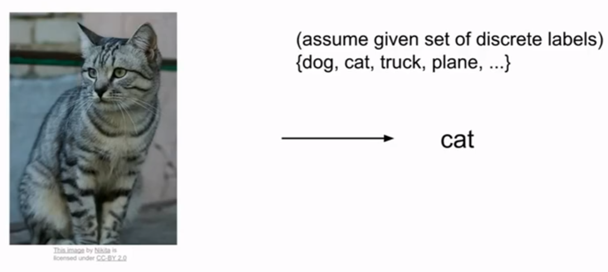

</div>

除了上述提到的如何透過這堆 pixel value 分類成某動物的問題，還需要考慮以下幾種情況:
1. viewpoint variation: 顧名思義就是我們看某事物的樣貌會隨著我們視角而改變，同樣地 pixel value 也會因此改變，同種動物圖片經過視角改變過後是否能夠依然判斷出是某種動物呢？
2. Illumination conditions: 不同亮度底下的動物圖片是否可以判斷出視同種動物？
3. deformation: 不同動物不會都只有相同姿勢，是否可以判斷不同姿勢下的動物是該種動物？
4. Occlusion: 被遮擋的情況下人類還是有辦法判斷出該種動物是哪種動物，電腦是否有辦法判斷？
5. Background cluttet: 如果背景與動物身上的紋路差不多是否也有判法判斷呢？


<div>


</div>

## 圖片分類的方法: data-driven approach

回到主題，我們該如何辨識一張圖片並對此圖片的內容進行分類？我們也許會很直覺地想要用下面的方法來偵測，但是目前還沒有辦法透過這麼直接的演算法來進行分類:

```python
def classify_image(image):
    # magic
    return class_label
```

另種想法是以動物的特徵進行分類，例如貓有貓耳朵，尾巴等等，我們對圖片進行邊緣偵測後，把邊與角分類好，但缺點是:
1.錯誤率過高
2. not scalable, 例如今天要偵測其他種動物，就得從頭來一遍，有點像是 hard-code 的概念， 我們要的是某種演算法可以通用在世界上各種東西上: data-driven approach

what is data-driven approach: 不寫具體的分類規則來辨識一隻貓或是一隻狗，而是透過大量的貓的圖片(dataset)，接著讓 machine 來 learning and classifier，也就是說消化大量圖片並讓 machine 以某種方式去做 summarize，知道如何辨識後讓 machine 去辨識新的圖片測試看是否可以正確辨識，因此我們不會只有單一個 function 去做到這些事情，我們需要:

1. train: 接收 input image and labels 然後 output model(memorize all data and labels)

    ```python
    def train(images, labels):
        # machine learning
        return model
    ```

2. predict: 接收 input model and output predict 

    ```python
    def predict(model, test_images):
        # using model to predict labels
        return test_labels
    ```

Example: CIFAR-10: 一個很小的 dataset, 包含 training set of 50000 images(涵蓋 10 種 lables) and test set of 10000 images, each image is 32x32x3

<div align="center">


</div>

## Nearest Neighbor Classifier

現實中不實用，但因為簡單且容易實做方便於了解 image classification problem。下圖為一個例子，有多個二維空間下包含五個顏色的點表示五個 category(class label), 而整張圖片中的每個 pixel 會根據最近的 class label 進行著色，也就是說整張圖會根據最接近的顏色點進行切割並塗上顏色形成下圖的樣子，缺點是可以看到綠色區域中有個黃色區域，而綠色區域深入了藍色與紫色的交界處等問題，因此有下面的 KNN 進行改善(Nearest Neighbor Classifier 應該就是 KNN 中 K=1 的情況)

<div align="center">


</div>

Nearest Neighbor Classifier 在 train 時因為只需要 copy data 因此只需要 O(1) (不管 data 多大, copy ptr 就夠了) 但是在 predict 上需要 O(N)(需要 compare)，因此這並不是個好方法，**我們會希望 classifiers 在 predict 上快一點， training 時慢一點沒關係**, 試想這個 calssifier 如果 deploy 在手機或是 browser 上時 predict 還那麼慢會拖垮整個速度, 但是 Nearest Neighbor Classifier 正好相反，在 train 時很快，在 predict 上很慢

## k-Nearest Neighbor Classifier(KNN)

為 supervised machine learning algorithm。KNN 的想法是物以類聚，越靠近的東西彼此就會越相似, 與 Nearest Neighbor Classifier 不同的是 KNN 並非找尋最近的 class label, 而是找到距離該 pixel 最近的 k 個 label 進行 majority vote, 該 pixel 就歸在票數多的 label(aka. **majority vote**), 也因此會盡量避免使用奇數的 K 值避免平手的情況, 通常較大的 K 值可以得到較平滑的邊界且較好的結果, 下面的圖與上面 Nearest Neighbor Classifier 相同的 dataset 可以看到上述提到的問題得到了改善, 其中白色的區域為在 K 個相鄰點中 no majority 

<div align="center">


</div>

### distance metric

上述有提到 KNN 就是物以類聚, 越相似的東西的距離就會越近, 因此我們透過 distance 去量化相近的程度, 計算 distance 的方法:

1. L1 distance(Manhattan distance): 直接拿兩張 image 的 pixel 進行相減並取絕對值，結果就是兩張圖片的相異值，下面為一張 4x4 的例子，差異值為 456，兩張相同的圖片透過 L1 distance 得出的差異值就是 0, 兩張 image 差異越大得出的差異值就也越大

<div align="center">

=\sum_p\mathopen|I_1^p-I_2^p\mathclose|)


</div>

2. L2 distance(Euclidean distance):

<div align="center">

=\sqrt{\sum_p(I_1^p-I_2^p)^2})

</div>

what is better? 無論是要如何選擇 distance function 還是 K 值的大小, 這兩者都是 **hyperparameters**, 意思是根據不同的目標與 data 而有不一樣的結果沒有絕對的好與壞, 最好的方法是兩者都試

### setting hyperparameter

根據上述面對這些 hyperparameter 該怎麼處理最好的方法就是試試看, 但要怎麼利用 data set 去調整？ 如果我們把所有的 data set 拿去 train 之後再做 test 得到的一定會是個不錯的結果, 這就是像是考試前跟你說會考什麼了, 因此正常來說拿到 data set 之後會先切割成兩塊分別為 train 與 test, 然而單只有 train set 還不夠好, 通常還會再切一塊 validation 出來驗證你 train 的結果, 依照 validation 的結果再修正一下後再進行 test, validation 的作用就像是模擬考, 驗證你準備的如何, 也可以根據模擬考讓你知道可能那一方面需要加強, test 則是最後的大考, 因此 test set 一定是最後才會碰到且只能碰這麼一次, 如果在 test 前就先偷看過就跟偷看考題一樣了

<div align="center">


</div>


### cross validation

除了上述切割的幾個 set 之外如果今天 dataset 較小, cross validation 的理念是一樣會把 train set 保留一份 validation set, 而 train set 輪流來當 validation set, 例如下圖中第一行 fold 1-4 拿來 train, 而 fold 5 就是用來驗證的, 接著用 fold 1-3 與 fold 5 train, 用 fold 4 進行驗證。

但通常不宜用在 deep learning 上面, 因為重新 train 需要耗費大量時間與計算能力

<div align="center">
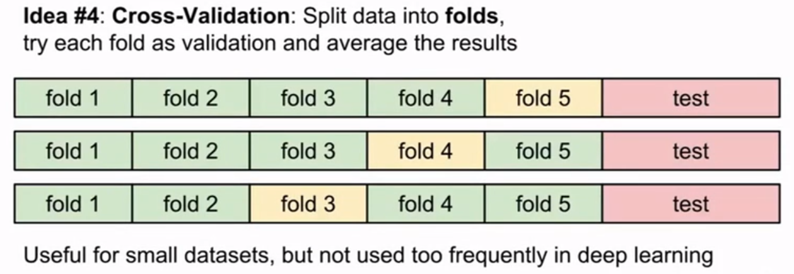
</div>

### problem of KNN

1. very slow at test time, 與我們的需求相反(fast at test time)
2. distance metrics on pixel are not informative: 
    * 上面介紹的像是 L1 distance or L2 並不適合用來描述圖片之間的相異程度, 例如下面四張圖片中右邊三張分別經過遮擋, shift pixel and 渲染成藍色, 經過 L2 distance 計算原圖與右邊三張經過處理的圖片後, 他們都有同樣的 L2 distance, 但明顯他們是不一樣的圖片, 因此我們可以知道 L2 distance 在這種視覺上的差異並不出色

<div align="center">
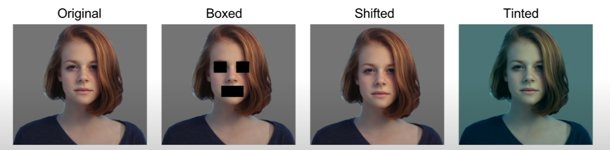
</div>

3. curse of dimensionality: 
    * KNN  做的事情像是利用 data point 去切割區塊出來, 沒有對任何情況進行假設, 所以它依賴於樣本空間上有一定密度的訓練樣本, 所以我們如果希望 classifier 有好的效果, data point 就得密集地出現在空間中避免最近的點離該 pixel 過遠, 也就是過於不相近。
    * 底下的圖片可以看到在一維時我們可能只用 4 個 data point 就夠了, 提升到二維時需要 16 data point, 隨著維度的增長我們可能沒有那麼多的 data point 可以分佈在空間中

<div align="center">
    
</div>

---

## Linear Classification

help us build up to whole neural networks and whole convolutional networks, 在 neural networks 經常將 linear classifiers 組合在一起建構成 large convolutional networks 

<div align="center">


</div>

### parametric approach

其中 x 代表 input image, 而 W 代表 weights, 在 Linear classification 之中我們不需要像 KNN 一樣需要 training set, 而是將這些 training set 總結成 W 後利用 f(x,W) 這個 function 與 W 就可以了，因此我們也可以搬移到手機這種 small device 進行因為不再依賴 training set。

f(x,W) 最後將會輸出十種 class 的 score:
* x: input image, 以 CIFAR-10 input 圖片就是 array of 32x32x3 numbers
* W: 權重, 經過 train set 得到的 summarize, 以 CIFAR-10 而言就是 (32x32x3)x10 的 numbers, 可以想成每一種 class 都有一種模板, 因為 10 種 class 所以乘 10
* b:  biases, 當 data set 不平衡時可以用來修正

<div align="center">


</div>

so linear classification 可以轉換成矩陣的相乘與相加, 對比 KNN 需要比對圖片而言相對的更加快速, 下面為一張 2x2 image 的例子, 包含 3 種 class(cat, dog, and ship), 可以看到最右邊 function 最後的輸出就是三種 class 獲得的分數, w 為經過 train set 獲得的每種 class 的模板, every row of W 就是某 class 的 classifier, x 就是 input image

<div align="center">


</div>

所以總結來說, linear classifiers 透過 train set 得到 W, 我們可以把 W 視為每種 class 的模板,linear classifiers 再利用這些模板透過矩陣相乘與相加後與 test set 進行比對(template matching), 找出分數最佳者。 因此我們可以視為 linear classifiers 依然在做 Nearest Neighbor 但是更有效率了 (矩陣相乘再相加>>>image compare)

下圖為 CIFAR-10 十種模板可視化的結果:

<div align="center">


</div>

### problem

如果將圖片從高維度壓縮到二維上面，Linear Classifier 就像是在找一條線切割出某 class 與其他 class, 如下圖左邊圖片

以此方式我們可以發現到 linear classifier 的一些問題:
1. 右邊第一張圖片: 紅色與藍色分別各自位在相反的象限上面，我們找不到一條線有辦法做切割
2. 右邊第三者圖片: multimodel situactions, 藍色 category 位在三個不同的象限上, 例如上面的 CIFAR-10 得到的十種模板中的馬就有此問題, 可以看到模板中有兩個頭, 一個向左看一個向右看, 這也是 linear classifier 無法解決的問題

<div>

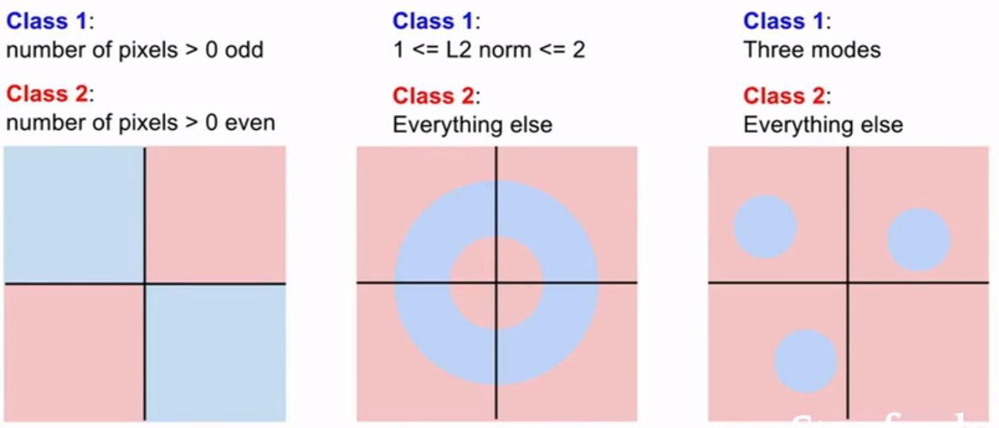
<div>

---

## loss function

承上述我們透過 score function, 將 input x 乘上 W 這個矩陣後最後加上 bias 得到對於各個 class 的 score, 如果我們分類正確的話在該 class score 相比其他 class 的分數應該來的高(最高), 但是該怎麼選擇這個 W 的矩陣? 且我們並沒有辦法控制 data (Xi,Yi) 但是 M 這個矩陣是我們可以控制的, 因此該如何調整 M 就更加重要了

**loss function** (aka. **cost function**, **objective**) **的作用就是量化真實數據與預測數據的差異程度, 以便知道目前參數的好壞, loss 越高表示越差**, input 為 hyperparameter 像是 W, bias:

<div align="center">

=\frac{1}{N}\sum_{n}e_n)

</div>

以下圖為例, cat score 僅有 -96.8, dog score 為 437.9 and ship score 為 61.95 因此可以知道這裡有很大的問題, 應該要是 cat score 最高的。而有好幾種 loss function 定義不同計算  的方式, 例如 MAE, MSE 等

<div align="center">


</div>

### Mean absolute error (MAE)

<div align="center">


</div>

### Mean square error (MSE)

### Multiclass Support Vector Machine loss


更精確地說法, (Xi,Yi) 分別代表了 input 與 label(index of correct class), 下面我們以 s 表示經由 f(x,w) (score function) 計算出來的 score:

<div align="center">

)

</div>

score for the j-th element:

<div align="center">

_j)

</div>   

Multiclass SVM loss:

<div align="center">


</div>

<br>

<div align="center">

<a href="https://www.codecogs.com/eqnedit.php?latex=\begin{align*}&space;where\:&space;&S_{y_i}:the\:&space;score\:&space;of\:&space;i-th\:&space;example,that\:&space;is\:&space;to\:&space;say,score\:&space;of\:&space;true\:&space;class&space;\\&space;&S_j:score\:&space;of\:&space;other\:&space;class&space;\end{align*}" target="_blank"></a>

</div>

<br>

<div   align="center">

<a href="https://www.codecogs.com/eqnedit.php?latex=\begin{align*}&space;Loss&=\frac{1}{N}\sum_{i}^{N}{\sum_{j\neq{y_i}}max(0,s_j-s_{y_i}&plus;\Delta)}&space;\\&space;&=\frac{1}{N}\sum_{i}^{N}{\sum_{j\neq{y_i}}max(0,f(W,x_i)_j)-f(W,x_i)_{y_i}&plus;\Delta)}&space;\end{align*}" target="_blank"></a>

</div>


Example:

<div align="center">


)

)


)

<br>

<br>
<br>

+max(0,-1.7-3.2+1))

+max(0,-3.9)=2.9)

+max(0,2.0-4.9+1))

+max(0,-1.9)=0.0)

+1)+max(0,2.5-(-3.1)+1))

+max(0,6.6)=12.9)

</div>

<br>

同個例子衍生的問題:

Q1: what happend to loss if car scores change a bit?

Ans1: 其實並不影響, SVM 在意的是正確的分數是否遠遠大於其他不正確的分數, 然而 car score 已經比其他分數還大了所以不影響

Q2: what is min/max possible loss?

Ans2: 0~infinity (如果非常正確則正確分數會遠大於其他不正確的分數導致loss為0)

Q3: At initailization W is small so all s->0, what is loss?

Ans3: (number of classes)C-1, that is to say, max(0,1)*(C-1) = C-1

Q4: What is the sum was over all classes(including j=y_i)?

Ans4: loss+1

Q5: what if we used mean instead of sum?

Ans5: 

Q6: what if we used:

<div align="center">
<a href="https://www.codecogs.com/eqnedit.php?latex=L=\sum_{j\neq{y_i}}max(0,s_j-s_{y_i}&plus;1)^2" target="_blank"></a>
</div>

<br>

還會是與剛剛上面是相同的問題嗎？還是會成為另外一個不同的分類算法？

Ans6:

會變成與上面不同，是另外一個 loss function，且平方會導致原本很小的錯誤被放大檢視，但在 linear loss function 裡面對於很小的錯誤是可以容忍的


#### hinge loss

<div align="center">
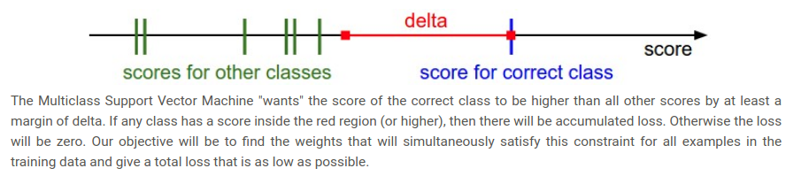
</div>

所謂的 hinge loss(名子由來是因為 function 像是打開的書, 見下圖) 就是像是 max(0,-) 這種 function, 仔細思考的話這個 function 就是有個 threshold 卡著, 如果小於 threshold 的話就是 0, 為什麼需要上面要用 max(0,-) 這種形式去表達 loss, 如果我們嘗試理解他的意思的話是用正確的分類 score 減去其他的分類的 score, 最後加上 Delta, **這段式子可以想成 SVM loss 對於分類的結果要求很高, 當我們 input 之後透過 score function 得到的 output 內容中的正確 class 的 score 要遠遠大於其他 class 的 score, 且至少超過 Delta 數值的量**, 如果分類的不夠好那麼就會被累加入 loss, 如果連那麼高要求都通過了那這個分類肯定不會太差

<div align="center">
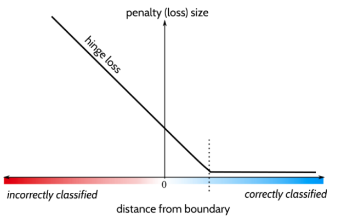
</div>


### overfitting

#### what is overfitting 

首先繼承上面 loss function 的範例, 思考 Suppose that we found a W such that L=0. Is this W unique?

Ans: No! 因為像是 2W 帶入也會讓 Loss=0 

承上例:

<div align="center">
<a href="https://www.codecogs.com/eqnedit.php?latex=\begin{align*}&space;Let\:&space;f(x,W)&=Wx&space;\\&space;&=max(0,1.3-4.9&plus;1)&plus;max(0,2.0-4.9&plus;1)&space;\\&space;&=max(0,-2.6)&plus;max(0,-1.9)&space;\\&space;&=&space;0&plus;0&space;\\&space;&=0&space;\end{align*}" target="_blank"></a>
</div>

<br>

<div align="center">
<a href="https://www.codecogs.com/eqnedit.php?latex=\begin{align*}&space;Let\:&space;f(x,2W)&=2Wx&space;\\&space;&=max(0,2.6-9.8&plus;1)&plus;max(0,4.0-9.8&plus;1)&space;\\&space;&=max(0,-6.2)&plus;max(0,-4.8)&space;\\&space;&=&space;0&plus;0&space;\\&space;&=0&space;\end{align*}" target="_blank"></a>
</div>

<br>

所以當一個 W 可以滿足 Loss = 0, 那我們便也可以找到其他 W 符合 Loss = 0 的結果, 只要 <a href="https://www.codecogs.com/eqnedit.php?latex=\lambda>1" target="_blank">1" title="\lambda>1" /></a>，任何 <a href="https://www.codecogs.com/eqnedit.php?latex=\lambda&space;W" target="_blank"></a> 都能使得 Loss 為 0。上面的 SVM loss 只關心了如何讓 Loss 為 0, 需要找到某 W fits training data:

<div align="center">
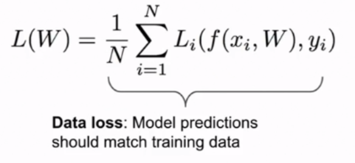
</div>

但實際上我們需要關心的並不是 fitting the training data, 整個 machine learning 的重點是我們使用 training data 去找到一些 classifier, 然後將他們應用在 test data 上面, 重要是在 test data 上的表現如何, 如果我們過於將 classifier fitting the training data 可能會讓 classifier 有異常的行為，例如下圖中藍色是 training data 的點, 如果我們嘗試吻合所有 training data 就會變成藍色這條非常曲折的曲線, 但是未來如果出現了綠色的 test data, 我們可以看到這條藍色的曲線是完全錯誤的, 我們會更加 prefer 的是這條綠色的線, 而這類的問題為 **overfitting: 在 training data 的 error rate 很低, 在 test data 的 error rate 卻很高**, 也可以想像 overfitting 就是某個一直在刷題目背題目的學生, 他只會解題庫裡面的題目, 但當大考出了新題目時他就一題都不會了。

<div align="center">
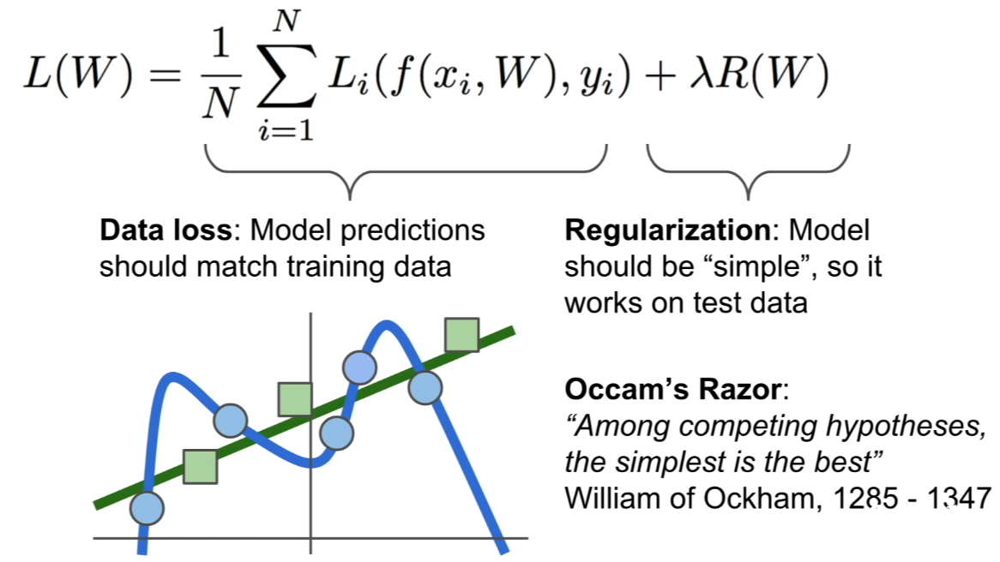
</div>

#### solution of overfitting

1. 限制 model class 不要有太高的階數或是太過複雜(避免太強)
2. **Regularization**: 在 loss function 加上 regularization term, 鼓勵 model 以某種的方式選擇更簡單的 W, regularization penalty 則是以 R 表示, lambda 則是用來 trade off data loss and regularization term, 所以總和 W, R, and lambda 的作用就是讓上圖中曲折的藍色線變成綠色線
 
---

### Softmax classifier(Multinomial Logistic Regression)

在 Multi-cliass SVM loss 中我們並沒有對 score function 輸出對於各個 class 的分數有一個很好解釋說分數到底是什麼意義, 只有強調 correct class 的分數要比不正確的 class 的分數還要高(甚至要高於某值);但在分數經過 softmax function 之後這些分數有了實質上的意義, 經過一串操作後這些分數會變成 positive number 後最後變成各個 class 的機率, 且每個 class 的機率皆介於 0~1 之間, 所有 class 的機率總和為 1，而理想上正確的分類所得到的機率應該為 1, 其他分類機率為 0

在 SVM 裡面的 loss function: hinge loss 也替換成 cross-entropy loss:

<div align="center">
<a href="https://www.codecogs.com/eqnedit.php?latex=\begin{align*}&space;L_i=-log(\frac{e^{f_{y_i}}}{\sum_{j}{e^{f_j}}})&space;\end{align*}" target="_blank"></a>
</div>

softmax function 就是其中的:

<div align="center">
<a href="https://www.codecogs.com/eqnedit.php?latex=\begin{align*}&space;f_j(z)=(\frac{e^{z_j}}{\sum_{j}{e^{z_k}}})&space;\end{align*}" target="_blank"></a>
</div>

<br>

在 cs231n 裡面講師稍微解釋了為什麼是取 negative log, 原因是 log is monotonic(單調) function, 要最大化 log function 相對簡單, 因此我們的目的是要讓正確的 class 有最大的機率, 只要針對最大化 log P of correct class 就完成了, 但由於 loss function 是用來量化壞的程度非好的程度 (loss 越高代表越偏離我們的 prediction), 因此我們加上一個負號更符合我們期待

Example:

<div align="center">
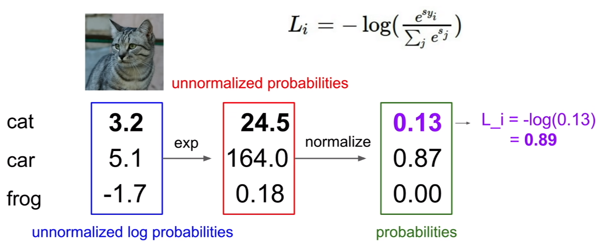
</div>

<br>

<br>
<div align="center">
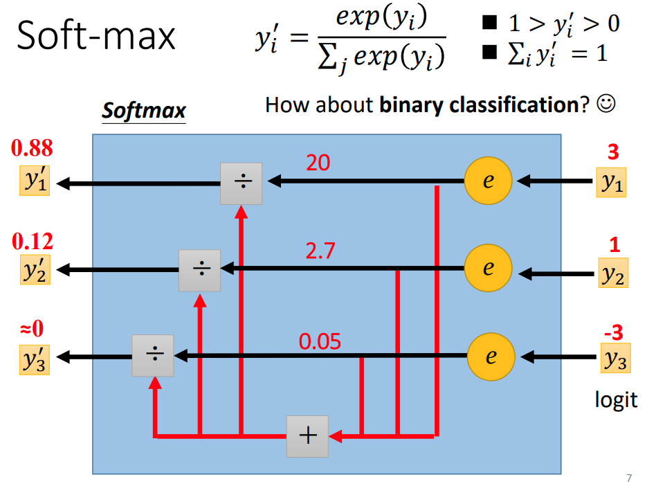
</div>

Q1: what is min/max possible loss L_i?

A1: min loss = 0, and max is infinity, 如果 classifier 超級正確, 讓將會讓 eq 變成 -log(1)=0, 即 loss=0; 如果正確的 class 機率為 0, 則 -log(0) = infinity

Q2: W is small so all s~0 what is the loss?

A2: log(c)

在做 softmax 時可能會遇到 numeric 上的問題, 因為有 exponential 的關係, 可能會讓數值變得很大, 有個技巧可以防止因為數值過大產生問題, 該技巧是在分子分母同乘上 C 而並不會影響計算結果, 類似做平移的概念:

<br>

<div align="center">
<a href="https://www.codecogs.com/eqnedit.php?latex=\begin{align*}&space;\frac{e^{f_y_{i}}}{\sum_{j}{e^{f_j}}}&space;=&space;\frac{Ce^{f_{i}}}{C\sum_{j}{e^{f_{j}}}}&space;=&space;\frac{e^{f_{i}&plus;logC}}{\sum_{j}{e^{f_{j}&plus;logC}}}&space;\end{align*}" target="_blank"></a>
</div>

<br>

```python
f = np.array([123, 456, 789]) # example with 3 classes and each having large scores
p = np.exp(f) / np.sum(np.exp(f)) # Bad: Numeric problem, potential blowup

# instead: first shift the values of f so that the highest number is 0:
f -= np.max(f) # f becomes [-666, -333, 0]
p = np.exp(f) / np.sum(np.exp(f)) # safe to do, gives the correct answer
```

#### multi SVM loss vs. softmax

對於 SVM 而言要求就是只要正確的 class 分數比其他 class 還要高出一個區間就可以算是 loss = 0, 但是對於 softmax 而言不一樣, softmax 會希望正確的分類跑出來的機率最好就是 1, 才會 loss = 0, 另外下圖中的例子分別利用兩種不同的方法得到的 loss 是不能比較的, 或是說沒有意義, 只有在同種分類器出來的 loss 值進行比較才有意義

<div align="center">

</div>

---

## Optimization 

目前筆記了:
1. score function: 將 input image 轉為分類的 score
2. loss funtion: 包含 SVM or softmax 等, 量化目前參數的好壞程度

而 otimization 則是要做到如何找出最好的參數讓 loss 最小的方法, 我們可以將此任務比喻為一個人走在山中, 要找到海拔最低的點, 

### strategy
#### 1: A first very bad idea solution: Random search

策略一就是矇著眼找到海拔最低點的過程。透過很多個參數 W 接著隨機取一者輸入 input 進行測試, 看每個 W 的結果如何, cs231n 提到以此方法測試 CIFAR-10 的 15% 的正確率, 但是這方法完全取決於運氣與隨機的機率

#### 2: Random Local Search

策略二則是生成幾個隨機的方向, 如果方向是往海拔更低的地方的話則往該處走一步, 接著重複步驟。隨機找出方向就是隨機生成 W, 接著生成一個隨機的走動距離: <a href="https://www.codecogs.com/eqnedit.php?latex=\begin{align*}&space;\delta&space;W&space;\end{align*}" target="_blank"></a>, 如果 <a href="https://www.codecogs.com/eqnedit.php?latex=\begin{align*}&space;W&plus;\delta&space;W&space;\end{align*}" target="_blank"></a> 的 loss 更低就更新 W, 否則不做更新的動作

#### 3: Following the Gradient

策略三則是先用腳體會一下地形哪邊最陡峭, 此陡峭程度就是 loss function 的 gradient, 接著朝著最陡峭的下降方向下山

在一維空間中的, 斜率可以代表某一點的瞬間變化率, gradient 不過只是他更 general 的說法, 可以應用在多維空間中, gradient 並非是 scalar, 而是 vector, gradient 就是由各個維度的斜率所組成的向量(aka. derivatives)

the derivative of a 1-D function:

<div align="center">
<a href="https://www.codecogs.com/eqnedit.php?latex=\begin{align*}&space;\frac{d(f)}{dx}=\lim_{h\rightarrow0}\frac{f(x&plus;h)-f(x)}{h}&space;\end{align*}" target="_blank"></a>
</div>

<br>

對於多個參數時我們稱之 derivatives partial derivatives, gradient 就只是對各個維度上做偏導數形成的向量

### computing gradient

1. finite differences: 就是直接用上面的定義下去求梯度, 缺點是太慢,  下面的例子僅有十個參數需要計算, 但如果 input 過多在計算一次的梯度運算上面就會花上過多時間, 且僅是求單一次梯度而已, 還未是最低點

<div align="center">
<a href="https://www.codecogs.com/eqnedit.php?latex=\begin{align*}&space;\frac{d(f)}{dx}=\lim_{h\rightarrow0}\frac{f(x&plus;h)-f(x)}{h}&space;\end{align*}" target="_blank"></a>
</div>

* 注意兩點:
    1. 雖然在數學中 h 代表一個非常小, 一個趨近於 0 的數字, 但是在實做上我們以 1e-5 就足夠了
    2. 使用 centered difference formula 的效果會更好:

<div align="center">
<a href="https://www.codecogs.com/eqnedit.php?latex=\begin{align*}&space;\frac{d(f)}{dx}=\lim_{h\rightarrow0}\frac{f(x&plus;h)-f(x-h)}{2h}&space;\end{align*}" target="_blank"></a>
</div>

<br>

cs231n example:

<div align="center">
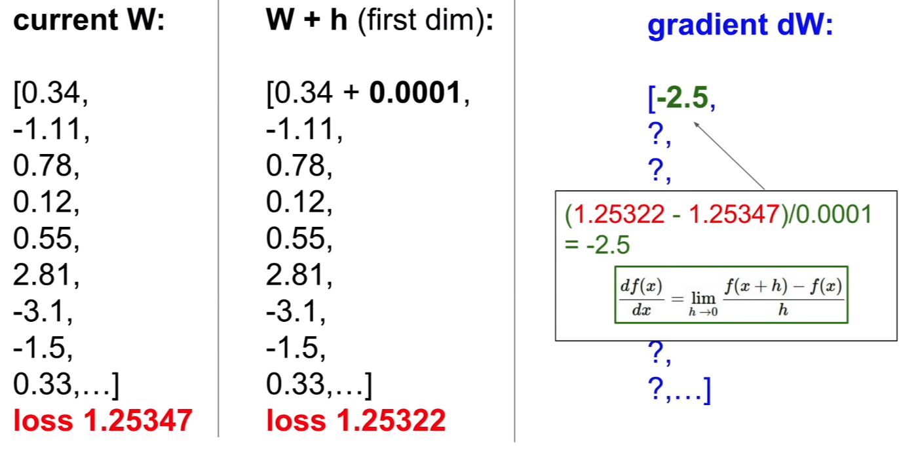
</div>

2. gradient check: 直接做微分, 可以省去針對每一個參數做計算的過程, 微分完再帶入即可, 下面為 SVM loss function 作為範例:

<br>

<div align="center">
<a href="https://www.codecogs.com/eqnedit.php?latex=\begin{align*}&L_i=&space;\sum_{j\neq&space;{y_i}}[max(0,w^T_{j}x_{i}-w^T_{y_{i}}x_{i}&plus;\Delta&space;)]&space;\\&space;&\bigtriangledown_{w_{y_i}}L_i=-(\sum_{j\neq&space;{y_i}}1(w^T_{j}x_{i}-w^T_{y_{i}}x_{i}&plus;\Delta&space;>0))x_i\end{align*}" target="_blank">0))x_i\end{align*}" title="\begin{align*}&L_i=&space;\sum_{j\neq&space;{y_i}}[max(0,w^T_{j}x_{i}-w^T_{y_{i}}x_{i}&plus;\Delta&space;)] \\ &\bigtriangledown_{w_{y_i}}L_i=-(\sum_{j\neq&space;{y_i}}1(w^T_{j}x_{i}-w^T_{y_{i}}x_{i}&plus;\Delta&space;>0))x_i\end{align*}" /></a>
</div>

<br>

其中 1 為 indicator function 表示如果括號中的條件為 true 則 function 值為 1, 如果為 false 則 function 值為 0

### Gradient Descent

計算出 loss function 的 gradient 接著對參數進行更新的過程稱為 Gradient Descent:

```python
while True:
  weights_grad = evaluate_gradient(loss_fun, data, weights)
  weights += - step_size * weights_grad 
```

其中 step size 又稱為 **learning rate**, 代表的意義是我們在找最低點時每次移動的距離大小, 如果我們跨一點有時候反而導致 loss 變高。同樣是 hyperparameter, cs231n 的講師提到在多個 hyperparameter 中優先對 learning rate 進行調整(要大一點還是小一點) 是不錯的選擇

### Mini-batch gradient descent 

在 training data 很多, 甚至多達百萬的情況時如果用上面描述的方法訓練, 為了更新一次參數可能就得花費大量運算資源與時間, 因此一個常用的技巧是訓練集中的小數據(**betches**)

---

## ref

* [Distance metrics and K-Nearest Neighbor (KNN)](https://medium.com/@luigi.fiori.lf0303/distance-metrics-and-k-nearest-neighbor-knn-1b840969c0f4)
* [cs231n](https://cs231n.github.io/classification/)
* [Day 5 / 必備實作知識與工具 / 關於 Training，還有一些基本功（一）](https://ithelp.ithome.com.tw/articles/10240556)
* [Cross-validation: evaluating estimator performance](https://scikit-learn.org/stable/modules/cross_validation.html)
* [機器學習：維度災難（Curse of Dimensionality）](https://blog.csdn.net/qq_39521554/article/details/80653712)
* [李宏毅-2021【機器學習2021】類神經網路訓練不起來怎麼辦 (四)：損失函數 (Loss) 也可能有影響 slide](https://speech.ee.ntu.edu.tw/~hylee/ml/ml2021-course-data/classification_v2.pdf)
* [李宏毅-2021【機器學習2021】類神經網路訓練不起來怎麼辦 (四)：損失函數 (Loss) 也可能有影響 YT](https://www.youtube.com/watch?v=O2VkP8dJ5FE&list=PLJV_el3uVTsMhtt7_Y6sgTHGHp1Vb2P2J&index=7&ab_channel=Hung-yiLee)