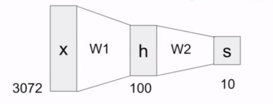
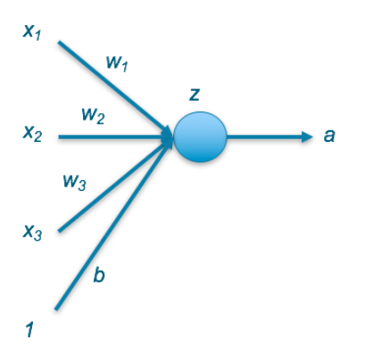
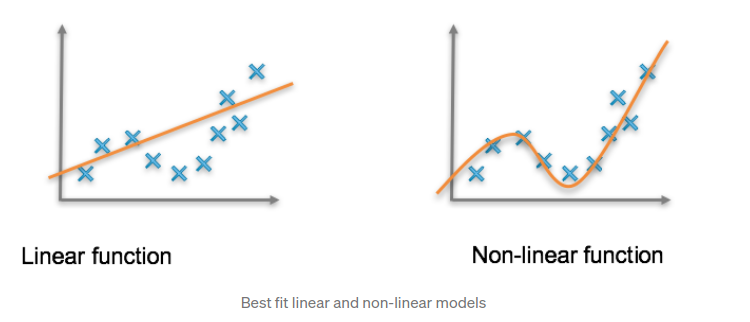
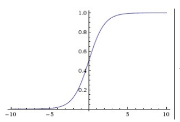
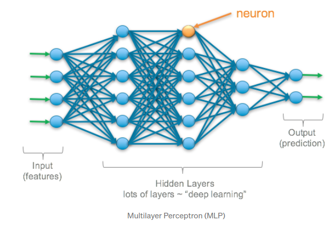
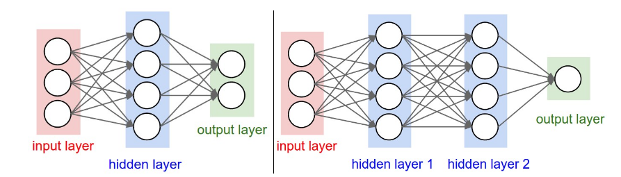

# neural network

## what is neural network

Neural networks(aka. **artificial neural networks (ANNs)**, **simulated neural networks (SNNs)**) 為 machine learning 的一個 subset, 同時是 deep learning algorithm 核心的架構。其名與架構源自動物中樞神經(人類大腦), 是一種模仿動物中樞神經的 computational model, 希望讓機器也能透過 neural network 而像是人類經由學習而有決定與判斷能力

在說明 neural network 類比動物中樞神經前, 先舉一個簡單的 neural network 例子, 在 linear classification 中我們將 score function 寫為下面形式:

 

* 其中以 CIFAR-10 舉例:
    * x = [3072x1] column vector, because each image in CIFAR-10 is 32x32x3
    * W = [10x3072] matrix, 同時我們可以把 W 想成是 10 class 的模板, 跟模板相近的就越可能是該 class
    * f(x,W) 的結果就是對 10 個 class 的分數

 

而在 neural network 中我們計算的方法不同, 例如我們可以改寫成下面形式:

 

其中 function max()  具有非線性性質, 有很多非線性 function 可以選擇, 但 max() 仍為常用的其中一個, 他的意義是如同設定一個 threshold 如果小於 0 就等同於 0 的概念。注意的是如果 W2 選擇 linear function, 將會與 W1 一起被簡化成某 linear function, 也就是說如果**將多個 linear function 疊加的話將會被簡化成某 leaner function, 多層 leaner function 將會等同於一層的 leaner function**, 因此我們也可以將 neural network 理解為 class of function, 藉由層次化的方式堆疊很多的 simple function 而得到一個更複雜的 non-linear function

* 其中以 CIFAR-10 舉例:
    * x = [3072x1] column vector, because each image in CIFAR-10 is 32x32x3
    * W1 = [100x3072] matrix, image 將會 transform into 100-dimensional vector
    * W2 = [10x100] matrix, 最後透過 W2 得到對於 10 class 的 score
* 意義(參考下圖):
    * 在只有一層 F=Wx 時提到 W 就是每個 class 的模板,甚至可以視覺化成十張模糊的圖片。在這裡兩層的情況, W1 依然是各種模板的集合, 但含有更多模板, 在只有十個模板時每個 class 就只有對應到一個模板, 例如車子可能對應到一台紅色的車子, 因此如果遇到其他顏色的車子可能會有很大機率沒有分類成功, 因此含有更多模板的概念就是可以讓一種 class 有更多模板, 例如同時包含紅色車子, 黃色車子等等, h 則是各種模板的得分, 例如黃色車子 1 分, 紅色車子 2 分, 最後經過 W2 將所有模板組合起來
    * 注意: W2 是加權, 會恆量各種模板而非僅僅找出模板中得分最大者
    * 非線性部分通常出現在 h 之前

 

更多層的 neural network:

---

## what is neuron

Neural networks 由 layers of neurons 組成, 同時是 network 中的 core processing unit。neuron(aka. **perceptron**), **The perceptron is a mathematical model of a biological neuron**, 簡單說就是個 mathematical function, 步驟包含:
1. input 與 weight 做 dot product 後加上 bias
2. 將步驟一的值傳入 activation function
3. 將 activation function 的結果 output

* 上圖的例子:
    * x: 來自 original features 或是前面 hidden layer 的 output
    * b: bias, 幫助 fit data 
    * a: output, 此 neuron 將 a 傳給他有連接的 next layer

---

## activation function

why need? **activation function 的目的是為了在 network 中引入 non-linear properties**, 經過矩陣乘法與加法仍然改變不了 linear 性質, 底下附上 linear 與 non-linear 的定義, 引用自 [Deep Learning: Overview of Neurons and Activation Functions](https://srnghn.medium.com/deep-learning-overview-of-neurons-and-activation-functions-1d98286cf1e4):

>A relationship is linear if a change in the first variable corresponds to a constant change in the second variable. A non-linear relationship means that a change in the first variable doesn’t necessarily correspond with a constant change in the second. However, they may impact each other but it appears to be unpredictable.

activation function 就是 non-linear function, and Why need non-linear in NN? 這個問題其實上面也有提過, 如果在 NN 裡頭無論有多少 layer, 但每個 layer 皆是 linear 的話都將會被化簡為 single-layer,

### Linear Activation Function

 

 

* 特性:
    * range: [0,1]
    * 曾經因為性質(0與1) 與 firing rate 相近而流行, 但後來的 ReLU 從生物學上看更合理

### Sigmoid Activation Function
### Hyperbolic Tangent Activation Function
### Rectified Linear Unit (ReLU) Activation Function
### Leaky ReLU Activation Function

---

## the architecture of neural networks

1. 架構: 由上圖可以看出 neural network 組成元素分別為:
    1. input leyer
    2. hidden layers
    3. output leyer

2. type: 最常見的 neural networks 為 **fully-connected layer**, layer 中每個 neuron 皆與相鄰的 layer 有連接

3. Naming conventions: 通常提到 N-layer nerual network 時的 n 並不包含 input layer
    * single-layer NN: only input and output, no hidden layer

4.

* Ex:
    * 左圖:
        * name: 2-layer NN (or 1-hidden NN)
        * fully-connected
    * 右圖
        * name: 3-layer NN (or 2-hidden NN)
        * fully-connected

---

## problems

1. what is neuron? what is difference between neuron and perceptron?
2. why need activation function(non-linear function) in NN?
3. explain NN architecture

---

## summary

---

## ref

* [Deep Learning: Overview of Neurons and Activation Functions](https://srnghn.medium.com/deep-learning-overview-of-neurons-and-activation-functions-1d98286cf1e4)
* [Why must a nonlinear activation function be used in a backpropagation neural network? [closed]](https://stackoverflow.com/questions/9782071/why-must-a-nonlinear-activation-function-be-used-in-a-backpropagation-neural-net)
* [the artificial neuron](https://cs.stanford.edu/people/eroberts/courses/soco/projects/neural-networks/Neuron/index.html)