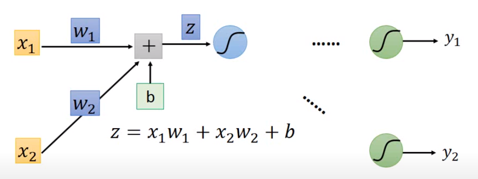
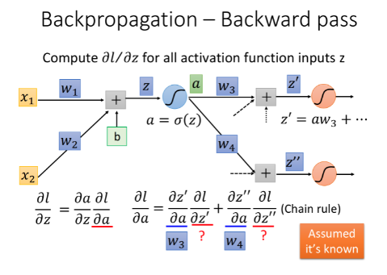
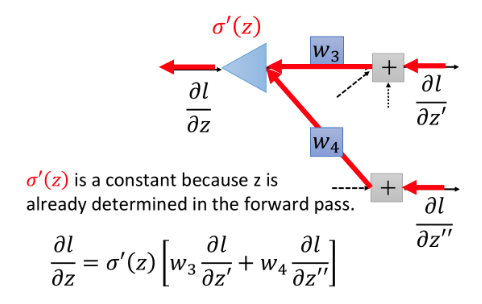
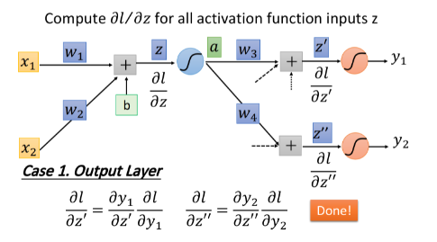
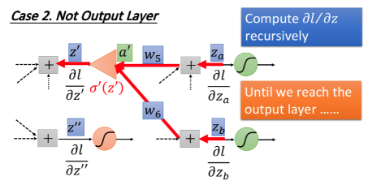

# backpropagation

backpropagation 為實際上用 gradient descent 的方法 train 一個 neural network 的 algorithm

## computation graph

利用 computation graph 來表達任意 function, 在 computation graph 中的 node 表示我們要執行的每一步運算, 一旦 function 可以利用 computation graph 來表達的話就可以利用 backpropagation 技術 recurively 利用 chain rule 算出每個維度的 gradient

Example:

 

 

 

利用變數取代中間的計算結果並計算偏微分的結果:

 

 

backpropagation 顧名思義就是從後面往前進行計算:

 

這邊開始沒有辦法直接獲得, 因此開始透過 chain rule 間接取得:

 

 

 

Q: 為什麼不直接做偏微分, 也可以直接得到一樣的結果是因為這邊的 function 太過簡單, 很容易做偏微分, 但如果是一個很複雜的 function 依然可以利用 computation graph 做出來且容易 implement

因此總結 computation graph 要如何計算 local gradient, 就是用上游得到的 gradients 乘上 local gradient 就能得到 input gradient, 上面只是個很簡單的例子, 甚至我們用偏微分就可以快速得到答案, 接著我們進一步說明該如何做 backpropagation:

以 [Hung-yi Lee ML2016 Lecture 7: Backpropagation](https://www.youtube.com/watch?v=ibJpTrp5mcE&list=PLJV_el3uVTsPy9oCRY30oBPNLCo89yu49&index=12&ab_channel=Hung-yiLee) 作為例子:

 

 

目標與 forward pass 與 backward pass 的定義:

 

 

 

## forward pass

我們可以很輕易的發現 forward pass 規律是, 其偏微的值 = 前一項連接的值

 

 

## backward pass

接著我們假設上圖中後面的 network 長這樣:

<a href="https://www.codecogs.com/eqnedit.php?latex=\small&space;\begin{align*}&space;\frac{\partial&space;Loss}{\partial&space;z}&=\:&space;\frac{\partial&space;Loss}{\partial&space;a}\frac{\partial&space;a}{\partial&space;z}&space;\\&space;\frac{\partial&space;Loss}{\partial&space;a}&=\:&space;\frac{\partial&space;Loss}{\partial&space;{z}'}\frac{\partial&space;{z}'}{\partial&space;a}&plus;\frac{\partial&space;Loss}{\partial&space;{z}''}\frac{\partial&space;{z}''}{\partial&space;a}&space;\\&space;&=\:&space;\frac{\partial&space;Loss}{\partial&space;{z}'}w_{3}&plus;\frac{\partial&space;Loss}{\partial&space;{z}''}w_{4}&space;\\&space;a&=\sigma&space;(z)&space;\\&space;\frac{\partial&space;a}{\partial&space;z}&={\sigma&space;}'(z)&space;\\&space;\frac{\partial&space;Loss}{\partial&space;z}&=\:&space;\frac{\partial&space;Loss}{\partial&space;a}\frac{\partial&space;a}{\partial&space;z}&space;\\&space;&=\:&space;(\frac{\partial&space;Loss}{\partial&space;{z}'}w_{3}&plus;\frac{\partial&space;Loss}{\partial&space;{z}''}w_{4}){\sigma&space;}'(z)&space;\end{align*}" target="_blank"></a>

 

因此我們可以總結為下圖, 注意 z 對我們而言是已知的, 在 forward pass 就已經能夠得到 z 值! 微分後代入 z 值並不會造成問題

 

整理後得到:

 

剩餘情況只要求出就完成了:

考慮兩種情況:

1. Output layer:

 

較為簡單的情況,  這個就是對 loss function 進行偏微分; 另一項  則是 output layer 的 activation function 進行偏微分

2. Not output layer

未到 output layer 其實就是再重複一次上面的推導過程, 直到抵達 output layer 為止, 這邊也說明了一開始說可以 recurively 利用 chain rule 計算到底是什麼意思

再次推導:

<a href="https://www.codecogs.com/eqnedit.php?latex=\small&space;\begin{align*}&space;\frac{\partial&space;Loss}{\partial&space;{z}'}&=\frac{\partial&space;Loss}{\partial&space;{a}'}\frac{\partial&space;{a}'}{\partial&space;{z}'}&space;\\&space;&=\frac{\partial&space;Loss}{\partial&space;{a}'}{\sigma&space;}'({z}')&space;\\&space;\frac{\partial&space;Loss}{\partial&space;{a}'}&=\frac{\partial&space;Loss}{\partial&space;z_{a}}\frac{\partial&space;z_{a}}{\partial&space;{a}'}&plus;\frac{\partial&space;Loss}{\partial&space;z_{b}}\frac{\partial&space;z_{b}}{\partial&space;{a}'}&space;\\&space;\frac{\partial&space;Loss}{\partial&space;{z}'}&=[\frac{\partial&space;Loss}{\partial&space;z_{a}}\frac{\partial&space;z_{a}}{\partial&space;{a}'}&plus;\frac{\partial&space;Loss}{\partial&space;z_{b}}\frac{\partial&space;z_{b}}{\partial&space;{a}'}]{\sigma&space;}'({z}')&space;\\&space;&=[\frac{\partial&space;Loss}{\partial&space;z_{a}}w_{5}&plus;\frac{\partial&space;Loss}{\partial&space;z_{b}}w_{6}]{\sigma&space;}'({z}')&space;\end{align*}" target="_blank"></a>

 

 

Example:

---

## ref

* [cs231n Course Notes : Backpropagation, Intuitions](https://cs231n.github.io/optimization-2/)
* [YT: cs231n Lecture 4 | Introduction to Neural Networks](https://www.youtube.com/watch?v=d14TUNcbn1k&list=PLC1qU-LWwrF64f4QKQT-Vg5Wr4qEE1Zxk&index=4&ab_channel=StanfordUniversitySchoolofEngineering)
* [Hung-yi Lee ML2016 Lecture 7: Backpropagation](https://www.youtube.com/watch?v=ibJpTrp5mcE&list=PLJV_el3uVTsPy9oCRY30oBPNLCo89yu49&index=12&ab_channel=Hung-yiLee)