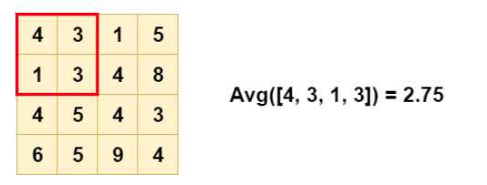

# Convolutional Neural Network

- [Convolutional Neural Network](#convolutional-neural-network)
  * [why need](#why-need)
  * [Property of image](#property-of-image)
    + [1. Some patterns are much smaller than the whole image](#1-some-patterns-are-much-smaller-than-the-whole-image)
    + [2. The same patterns appear in different regions](#2-the-same-patterns-appear-in-different-regions)
    + [3. Subsampling the pixels will not change the object](#3-subsampling-the-pixels-will-not-change-the-object)
  * [terminology](#terminology)
  * [architectures](#architectures)
    + [Convolutional Layer](#convolutional-layer)
    + [Pooling Layer](#pooling-layer)
      - [max pooling](#max-pooling)
      - [avg pooling](#avg-pooling)
      - [disadvantage](#disadvantage)
    + [Normalization Layer](#normalization-layer)
    + [Flatten](#flatten)
    + [Fully-Connected Layer](#fully-connected-layer)
  * [ref](#ref)

---

## why need

In [image classification](), 我們說明對電腦而言圖片就是一堆數字, 而這些數字拿出來排成一排後形成一個巨大的向量(代表的意義是 pixel, 在某顏色的強度), 此向量將會作為 network 的輸入:

在 image processing 中使用 fully connected 會產生什麼問題呢? 假設以 100x100 的圖片舉例, 輸入就會是 100x100x3 的 vector, 而假如我們的 network 裡頭的 hidden layer 又有 1000 neuron, 則我們就會產生 100x100x3x1000 的 weight, 光是第一層 layer 就高達 30000*1000 可想而知計算能力與時間的成本有多高, 而且參數越多, 我們雖然增加 model 的彈性, 但同時增加了 overfitting 的風險(TODO:WHY?), 因此 CNN 就是想要來解決此問題

 

CNN 解決上述問題的想法: 簡化 Neural Network 的架構, 根據我們對於 image 的觀察(下面會提及)我們可以把一些實際上不用使用到的參數給省略掉, 因此 CNN 相比 DNN 是更為簡單的架構, 但重要的是 CNN 是因為 image 有某些特徵才可以這麼做, 如果要將 CNN 應用至非影像方便的話得先思考該領域是否有 image 的這些特徵

## Property of image

### 1. Some patterns are much smaller than the whole image

對於影像辨識這個問題來說, 如果我們想要知道這張圖片是否某動物該怎麼做?對於 Neural network 裡面的 neuron 而言他要做的也許是去偵測圖片中有沒有重要的一些 pattern, 這些 patterm 代表了某動物, 例如: 某個 pattern 代表看到鳥嘴, 另個代表鳥眼睛等等, 如果你覺得看 pattern 來決定是不是某動物是很不聰明的作法可以點開看下面的圖片, 人類是不是其實也是用相同的作法來看圖片呢?

  
Click to expand!

    

    
    

 

 

所以如果 neuron 要做的是去偵測圖片中有沒有重要的一些 pattern 出現, 那 neuron 就不用去看一張完整的圖片, 因為 pattern 不需要看整張圖片只需要一小部份的圖片就可以看到了, 例如要看是不是一個鳥嘴我們只要看一小塊區域就知道了。 **如果 neuron 只需要看某小區域, 那所需要的參數也更少了**

### 2. The same patterns appear in different regions

 

同樣的 pattern 可能會出現在 image 不同的位置, 例如上圖中同樣是鳥嘴, 但可能會出現在圖片各個區域, 例如第一張圖片出現在左上角, 第二張出現在中間等等, 但是同樣是鳥嘴, 都可以被同樣的 neuron 同樣的參數的 detector 給檢測出來, 如果只因為在圖片位置不同就訓練兩個或是多個 detector 去偵測不同位置的鳥嘴過於浪費資源, neuron 會看見圖片不同的位置(類似於部份螢幕截圖,每個 neuron 擷取的區塊不一樣), **只要讓 neuron 可以共用參數, 就能減少參數的數量**

### 3. Subsampling the pixels will not change the object

 

在一開始提及 fully connected 的問題中包含了參數過多的問題, 而圖片大小也是影響參數過多的一個因素 ,但試想如果把圖片縮小是否會影響人對圖片的理解? 是不會的, 因此如果把圖片縮小的話也可以有效減少參數的數量

---

## terminology

在 property 1 提到的只需要看一小部份的圖片稱為 Receptive field, 而 Receptive field 也可以跟之前一樣經過展開後形成 vertor, 例如上圖中變成 27 維的向量作為 neuron 的輸入, neuron 的 weight 乘上 27 維的向量後加上 bias 後輸出給下一層的 neuron 作為輸入, 因此每個 neuron 只考慮自己負責的 Receptive field(跟 property1 提到的:每個 neuron 只考慮圖片中的一小部份相同道理)

* Receptive field 特性說明:
    * Receptive field 的安排方式很自由, 可以是長方形, depth 也可以不用跟 input 一樣等等, 下列只列出較為經典的設計方式
    * Receptive field 的 depth 通常與 input 相同, 這邊的 depth 是指 image channel, 黑白為 1, 彩色為 3, 因此描述 Receptive field 的大小時通常只會描述 width 與 height 而不會多說明 depth, 稱為 **kernel size**, 
    * Receptive field 的大小如何決定:  人為決定, 以 image 來說 kernel size 3x3 已經足夠  
    * Receptive field 可以 overlap, 也可以完全相同。並且時常會 overlap, 避免 pattern 出現在兩個 Receptive field 交界處的情況, 兩個 Receptive field 的距離稱為: **stride** (往往為 1 or 2)
    * 超出影像範圍會補 padding, 常見的為 zero-padding
    * 同個 Receptive field 通常會有多個 neuron 偵測

* 關於 stride 與 outpu size 的運算:
    * 不考慮 zero-padding:        
        * 令 input image 為 NxN, filter 為 FxF
        * output size = (N-F)/stride +1
            * ex: N=7, F=3, stride=1, output size=(N-F)/1+1=5
            * ex: N=7, F=3, stride=2, output size=(N-F)/2+1=3
            * ex: N=7, F=3, stride=3, output size=(N-F)/3+1=2.33 :(
    * 考慮 zero-padding:
        * 即 input size 變大, 加上 padding 即可, output size = (N−F+2P)/stride+1
        * F=7, stride=1, pad with 1 pixel, 3x3 filter
            * F = F+2=9, (9-3)/1+1=7, hence output size: 7x7
        * 常見作法: **zero padding with (F-1)/2**
            * ex: F=3 => zero pad with 1
            * ex: F=5 => zero pad with 2
            * ex: F=7 => zero pad with 3

 

在 property2 提到的希望讓 neuron 共享參數, 而一個 Receptive field 也有多個 neuron 偵測, 因此例如上圖不同的 Receptive field 各自都有多個 neuron 在偵測, 而顏色相同的就是擁有相同的參數, 這些參數又稱為 **filter(kernel)**。

對於不同 Receptive field 擁有相同參數並不會讓輸出也一樣, 因為 Receptive field 代表了輸入的不同, 因此輸出也不同, 如果對於同 Receptive field 的 neuron 才會造成輸出一樣的結果(可以參考上圖)

---

## architectures

CNN architectures 由以下不同 type 的 layer 組成:
* Convolutional Layer
* Pooling Layer
* Normalization Layer
* Fully-Connected Layer

### Convolutional Layer

首先我們先看 channel = 1 的黑白照片, 在 Convolutional Layer 裡面有多個 filter, 而每個 filter 其實就等同於 NN 裡面的每一個 neuron, 以 matrix 表示, filter 內的數字代表參數, 與 neuron 的 weight 和 bias 相同, 皆為經過 training 得到的非人為設計, 假設目前的 filter 為 3x3 的大小進行滑動, filter 將會由圖片的左上角進行 dot product 後接著往右滑動一個 stride 的距離再進行 dot product, 直到掃過整張圖片, 最後得到一個 4x4 大小的 matrix, 稱為 **activation map** (aka. **feature map**)

結果如上圖, 其中可以看到 3 是 activation map 中最大的值, 分別出現在左上與左下角, 意義是在圖片左上以及左下角有出現該 pattern

 

**假如有 k 個 filter，就會形成 k 個 activation map，下一層的 depth 也是 k**, 因此如果我們一共有 64 的 filter, 最後將會產生 64 張 4x4 的 feature map, 我們可以將這 64 張 4x4 的 feature map 作為新的圖片再丟入下一層的 convolution layer, 此時對於下一層的 convolution layer, input 圖片的 channel 不再是 1, 而是 64。

 

假設下一層的 convolution layer 的 filter 一樣是 3x3(上圖的藍色線), 但其實他看到了更大張的圖片, 我們可以看到藍色線匡選出來的範圍將是原本的圖片中的 5x5 的範圍大小, 而在 property2 提到的如何共用參數這件事情, 其實就是 filter 掃過整張圖片, 記得 filter 就是參數, 因此掃過整張圖片的過程就是共用參數了!

最後如果是彩色圖片的話, channel 為 3, filter 便不再是 matrix 而是一個立方體, input 以下圖為例為 6x6x3, filter 為 3x3x3, 做 convolution 時就是把 input 每一層與 filter 每一層進行 dot product 得到三層的 output, 相比於黑白時就是從一層變成三層而已

 * 最後總結:
    * Convolutional Layer 由一些 learnable filters(非人類定義) 組成, 每個 filter 會有跟 input 相比更小的 width 與 height, 但是 depth 會與 input 相同, 也就是說 filter 就是 input 的一小部份, 在 forward pass 中, 每個 filter 將會在 input volume 的 width 與 height 上進行滑動(更精準的說法:convolve)經過 dot product 後生成 activation map, activation map 代表了 filter 對 input 中某空間上的反應, 當某空間有某 pattern 時會產生較高的數值

    * hyperparameter:
        * receptive field size
        * stride
        * size of zero-padding
            * 注意這幾個參數是互相限制的
                * ex: input w=10, P=0, filter=3, stride=2, and output size = (10-3-0)/2+1=4.5, which is not working
            * 真實例子參考 [CS231n Convolutional Neural Networks for Visual Recognition](https://cs231n.github.io/convolutional-networks/) 提及的: 
            
                >"Real-world example. The Krizhevsky et al. architecture that won the ImageNet challenge in 2012 accepted images of size [227x227x3]. On the first Convolutional Layer, it used neurons with receptive field size F=11, stride S=4 and no zero padding P=0. Since (227 - 11)/4 + 1 = 55, and since the Conv layer had a depth of K=96, the Conv layer output volume had size [55x55x96]. Each of the 55*55*96 neurons in this volume was connected to a region of size [11x11x3] in the input volume. Moreover, all 96 neurons in each depth column are connected to the same [11x11x3] region of the input, but of course with different weights. As a fun aside, if you read the actual paper it claims that the input images were 224x224, which is surely incorrect because (224 - 11)/4 + 1 is quite clearly not an integer. This has confused many people in the history of ConvNets and little is known about what happened. My own best guess is that Alex used zero-padding of 3 extra pixels that he does not mention in the paper."

[視覺化](https://cs231n.github.io/convolutional-networks/):

 

 

---

### Pooling Layer

在連續的 Convolutional layer 中我們還會週期性的插入一個 Pooling Layer, 作用是把圖片變小, 降低運算量與參數數量, 也能有效控制 overfitting, 最常見與最有效的方法為 max pooling

#### max pooling

最常見的形式為 2x2 的 filter, 以 stride 為 2 進行採樣, 其中 75% 的訊息都捨棄, 只留下四個數字中最大者:

#### avg pooling

以 2x2 filter 為例, avg pooling 則是將 4 塊訊息加總後取平均作為這四塊的代表:

#### disadvantage

試考慮較為精細的圖片, 如果做了 pooling 可能會導致 perfermance 變差, 因此在計算效能足夠的前提下, 往往直接捨去掉 pooling, 在 cs231n 舉的例子為:
    
> Getting rid of [pooling. Many people dislike the pooling operation and think that we can get away without it. For example, [Striving for Simplicity: The All Convolutional Net](https://arxiv.org/abs/1412.6806) proposes to discard the pooling layer in favor of architecture that only consists of repeated CONV layers. To reduce the size of the representation they suggest using larger stride in CONV layer once in a while. Discarding pooling layers has also been found to be important in training good generative models, such as variational autoencoders (VAEs) or generative adversarial networks (GANs). It seems likely that future architectures will feature very few to no pooling layers.

Hung-yi Lee 提及的例子為 Alpha Go, 試想棋盤上如果少了一行或是一列, 對於 perfermance 一定是個很巨大的傷害:

---

### Normalization Layer

Normalization Layer 的用是為了抑制大腦的觀測機制, 但 Normalization Layer 最近沒那麼流行, 因為即使效果存在, 也很有限

---

### Flatten

而經過 convolution 和 max pooling 後, 我們會做 Flatten 將 feature map 給拉直成一個 vector, 最後再輸入 Fully-Connected Layer

---

### Fully-Connected Layer

經過 convolution 和 max pooling 後, 我們已經得到一個相較於原圖少很大部份的 vector, 最終我們只需要 Fully-Connected Layer 做最後的分類工作就完成了

---

## ref

* [CS231n Convolutional Neural Networks for Visual Recognition](https://cs231n.github.io/convolutional-networks/)
* [Hung-yi Lee:Convolutional Neural Network (CNN)](https://speech.ee.ntu.edu.tw/~hylee/ml/ml2021-course-data/cnn_v4.pdf)