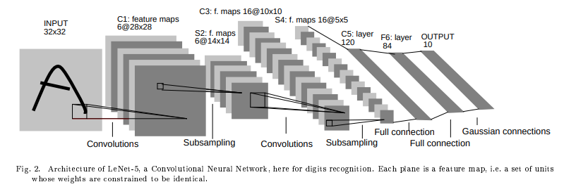

# popular CNN Architectures

## LeNet-5

發表自 1998, LeNet 是用來解決數字辨識問題 (可搭配 MINST), LeNet-5 架構如下圖:

[from: Gradient-Based Learning Applied to Document Recognition](http://yann.lecun.com/exdb/publis/pdf/lecun-01a.pdf)

由 2 convolutional layers, 2 subsampling layers 與 3 fully connected layers 組成, LeNet-5 的 5 是因為 5 layers with learnable parameters, input 為 channel = 1 的黑白照片:

 

details(計算方法可以參考 [04_CNN:terminology](04_CNN.md#terminology)):

|Layer|filter size|filters|stride|activation function|feature map size|
|:---:|:---:|:---:|:---:|:---:|:---:|
|input|-|-|-|-|32x32x1|
|Conv1|5x5|6|1|tanh|28x28x6|
|Avg. Pooling1|2x2|-|2|-|14x14x6|
|Conv2|5x5|16|1|tanh|10x10x6|
|Avg. Pooling2|2x2|-|2|-|5x5x16|
|Conv3|5x5|120|1|tanh|120|
|Fully Connected1|-|-|-|tanh|84|
|Fully Connected2|-|-|-|softmax|10|

* TODO: trainable parameters
* TODO: connections
    * [nice slide](https://www.slideshare.net/ssuser2e52e8/lenet5)

---

## AlexNet

[ImageNet Classification with Deep Convolutional Neural Networks](https://papers.nips.cc/paper/2012/file/c399862d3b9d6b76c8436e924a68c45b-Paper.pdf)

特點:
1. 第一次使用 ReLU

|Layer|filter size|filters|stride|padding|activation function|feature map size|
|:---:|:---:|:---:|:---:|:---:|:---:|:---:|
|input|-|-|-|-|-|227x227x3|
|Conv1|11x11|96|4|-|ReLU|55x55x96|
|Max Pooling1|3x3|-|2|-|-|27x27x96|
|Conv2|5x5|256|1|2|ReLU|27x27x256|
|Max Pooling2|3x3|-|2|-|-|13x13x256|
|Conv3|3x3|384|1|1|ReLU|13x13x384|
|Conv4|3x3|384|1|1|ReLU|13x13x384|
|Conv5|3x3|256|1|1|ReLU|13x13x256|
|Max Pooling2|3x3|-|-|2|-|6x6x256|
|Dropout||rate=0.5||||6x6x256|
|FC1|-|-|-|-|ReLU|4096|
|Dropout||rate=0.5||||4096|
|FC2|-|-|-|-|ReLU|4096|
|FC3|-|-|-|-|Softmax|1000|

---

## ref

* [LeNet-5 論文: Gradient-Based Learning Applied to Document Recognition](http://yann.lecun.com/exdb/publis/pdf/lecun-01a.pdf)
* [LeNet-5 網站](http://yann.lecun.com/exdb/lenet/index.html)
* [towardsdatascience:Illustrated: 10 CNN Architectures](https://towardsdatascience.com/illustrated-10-cnn-architectures-95d78ace614d#c5a6)
* [The Architecture of Lenet-5](https://www.analyticsvidhya.com/blog/2021/03/the-architecture-of-lenet-5/)
* [Introduction to The Architecture of Alexnet](https://www.analyticsvidhya.com/blog/2021/03/introduction-to-the-architecture-of-alexnet/)