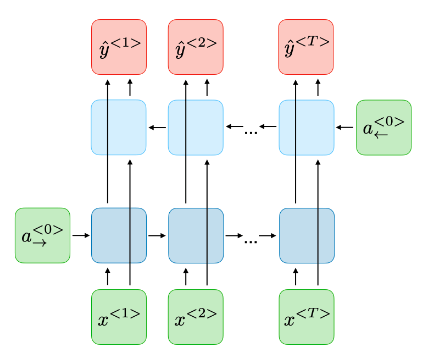
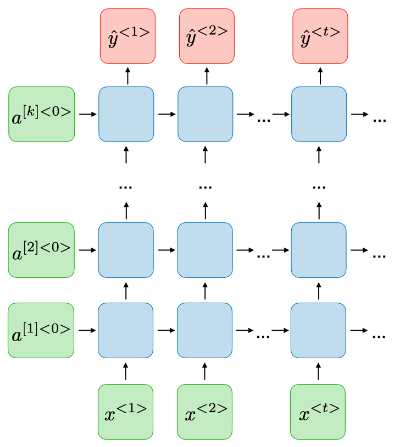
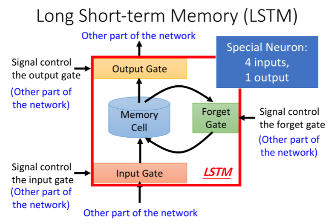
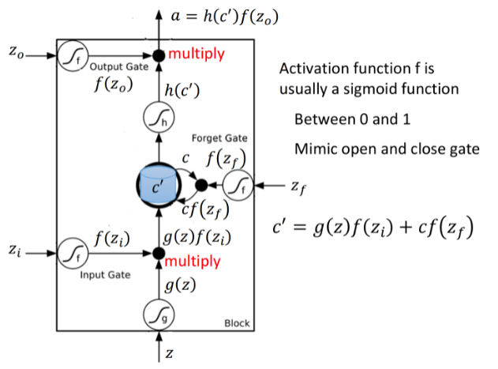
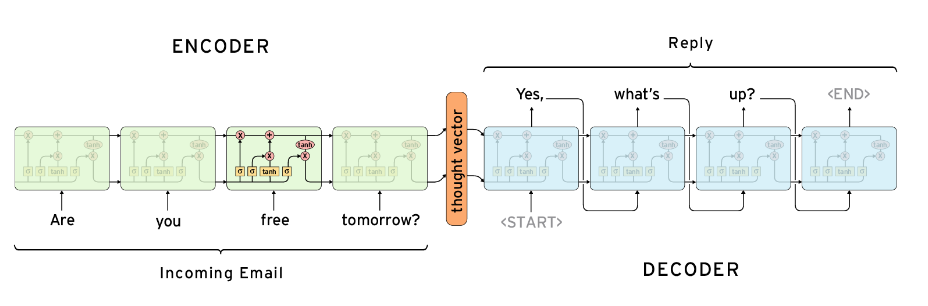

# Recurrent Neural Network

- [Recurrent Neural Network](#recurrent-neural-network)
  * [why need](#why-need)
  * [architecture](#architecture)
    + [vector](#vector)
      - [one-hot encoding](#one-hot-encoding)
      - [word embedding](#word-embedding)
    + [Elman RNN (Vanilla RNN)](#elman-rnn--vanilla-rnn-)
    + [Jordan network](#jordan-network)
    + [Bidirectional RNN (BRNN)](#bidirectional-rnn--brnn-)
    + [Deep RNN (DRNN)](#deep-rnn--drnn-)
  * [long short-term memory (LSTM)](#long-short-term-memory--lstm-)
  * [seq2seq](#seq2seq)
    + [disadvantage](#disadvantage)
  * [ref](#ref)

## why need

回顧一下, 目前至今我們討論的內容都是 input 有固定的大小, 例如一張固定大小的圖片, 我們可以將圖片展開成 vector, 經過 hidden layer 後輸出某 score or class, 但是試想今天如果輸入不是固定的, 可能有長有短, 輸入將會不再只是單一個 vector, 將是 set of vector 而我們沒辦法預期 set 裡面有多少內容

到這裡我們可以思考相對的解決方式, 例如將 set 裡面的成員單一個取出來後 input 到 NN 裡頭讓他輸出, 這樣就得到了 set 每個 element 的 output, 但是 set 裡頭的 element 如果前後彼此有關係, 例如上圖中兩個 saw 明顯是不一樣的意思, 我們需要前後文判斷詞性後才知道意思

因此, 我們需要透過 RNN 處理這種 Sequential data, 但注意 RNN 同樣適用於 fixed size input 與 output 的情況!

 

* 一些各情況的例子:
    * one to many: input 為一張圖片, 輸出為對圖片的一段描述
    * many to one: 
        1. input 為一段句子, 輸出為此段句子為 positive or negative。
        2. input 為一段影片, 影片長度的不同代表著 frame 數量的不同, output 為此段影片正在做什麼運動
    * many to many: 翻譯, input 為 a 語言經過機器翻譯後成 b 語言, 而同一句話在不同語言中所需要的長度有可能不同
    * many to many(上圖中最右邊者): 需要對 input 中每一個 element 都做處理

 

(常見的 RNN 應用)

---

## architecture

現在考慮一個 network 的 input 是一個句子的話, 要如何將句子轉換成 vector?

### vector

#### one-hot encoding

將每種詞彙對應到一個 vector, 也就是對應的一個維度, 缺點是沒有辦法透過 one-hot vector 來判斷說某兩個 vector 之間的相近程度(不帶有語意資訊)

#### word embedding 

我們可以把一個句子透過 word embedding 後得到一個向量, 同時帶有語意資訊

#### TODO: [ML Lecture 14: Unsupervised Learning - Word Embedding](https://www.youtube.com/watch?v=X7PH3NuYW0Q&ab_channel=Hung-yiLee)

在講述 RNN architecture 之前先試著以一個簡單的例子介紹, 下面會以 word embedding 的方式將某些 word 轉換成向量輸入至下圖中, 圖中的所有 weight 都設定為 1, 可以將 RNN 想成有記憶力(memory)的 NN

|word|vector|
|:---:|:---:|
|你|00|
|祖|10|
|我|01|
|孫|11|

 

將 input "你" 轉換為 vector 00 後輸入至 network, 因為 weight 皆為 1 得到藍色處皆為 0, 將藍色處結果儲存至紅色處, 最後得到 output 為 0。

 

將 input "祖" 轉換為 vector 01 後輸入至 network, 因為 weight 皆為 1 得到藍色處皆為 1, 再與 step1 計算出來儲存至 memory 的部份相加, 並將藍色處結果儲存至紅色處, 最後得到 output 為 3

因此 RNN 裡的 memory 會用來存放 hiddem layer 的 output, 在下一次輸入時 RNN 不僅會考慮 input, 也會考慮 memory 裡的值

 

中間省略了剩下的計算過程,最後得到的結果:

|word|vector|
|:---:|:---:|
|你祖我孫|42,42|
|我祖你孫|114,114|

上述情況如果使用 Letent Semantic Analysis(LSA) 只單純將詞彙所切開判斷的話兩句話會是一樣的意思, 但是經過 RNN 的結果我們可以看到 output 不一樣, 也就是成功判斷出兩句話不同, **因此 RNN 會考慮 input seqence 的 order**

 

(將上述的計算過程給展開)

 
 

(RNN Computational Graph)

### Elman RNN (Vanilla RNN)

Elman RNN 就是我們上述舉的例子, 將 hidden layer 的值給存起來, 在下一個時間再讀出來

hidden state update:

output generation:

### Jordan network

與 Elman Network 的差異是 Jordan network 存的是 output 非 hidden layer 的結果

### Bidirectional RNN (BRNN)

### Deep RNN (DRNN)

---

## long short-term memory (LSTM)

 

在上面我們對 memory 的概念是叫簡單版本, 可以隨時進行讀取, 現在常用的 memory 管理方式稱為 long short-term memory (LSTM)

* 3 gate:
    1. input gate: 
        1. 當 neuron 要將輸出寫入 memory 時必須先經過 input gate, 如果 input gate 是關閉的情況則無法寫入
        2. 開啟關閉的時機由 NN 透過學習得到
    2. output gate:
        1. 決定何時可以從 memory 讀出內容, 關閉時一樣無法讀 memory 內部的內容
        2. 開啟關閉的時機由 NN 透過學習得到
    3. forget gate:
        1. 決定何時清除 memory 內的內容
        2. 開啟關閉的時機由 NN 透過學習得到
        3. **注意: 當 forget gate 打開時是記得目前的內容, 關閉才是清除目前的內容**

而被稱為 long short-term memory 的原因此時也可以理解了, 在過去較為簡單的 memory 裡頭使用的 memory 隨時都可以 access, 且馬上就會被下一次 hidden layer 的輸出給洗掉, 但是對於 long short-term memory 而言更加嚴格管理什麼時候可以讀寫與清楚且只要不開啟 forget gate 的話 memory 內的內容也就能同時存放較久而不是馬上被清楚

* 整個 LSTM 可以視為特別的 neuron 具有:
    * 4 個 input: 
        1. 要被存放到 memory 的值
        2. 控制 input gate 的信號
        3. 控制 output gate 的信號
        4. 控制 forget gate 的信號
    * 1 個 output

(LSTM formulation)

* 如果以正規的角度來看 LSTM:
    *  為需要存到 memory 裡的值
    *  控制 input gate 的訊號
    *  控制 forget gate 的訊號
    *  控制 output gate 的訊號
    * a: output

* step:
    * (下面對於 , ,  的 activation function 通常選用 sigmoid function 讓輸出保持在 0 與 1 之間更加富有 gate 的用意)
    1.  經過 activation function 得到 ,  經過 activation function  得到 
    2. 將 step1 兩項相乘:  
    3. memory 內容經過 activation function 得到 
    4. 得到新的 memory 內容: 
        * 若  為 0: 相當於沒有輸入; 若為 1 也等同於 
        *  為 1 則新 memory 內容為輸入再加上原有 memory 內容; 為 0 則等同於輸入直接捨棄原有內容
    5. 

Example: TODO

---

## seq2seq

如上文所提, 在 machine translation 時我們時常碰到 input 與 output length 不同的情況, 而我們需要透過 input sequence 去 predict output, Encoder-Decoder Model 就是用來處理這類情況 (可以把 seq2seq 當成目的, Encoder-Decoder Model 是解決 seq2seq 的方法)。常用於 NLP 中, 廣泛使用於 machine translation, 語音辨識等

1. 一個 RNN 作為 encoder: 將 input sequnce 消化後轉為某向量, 稱 **context vector**, 可以將 context vector 想成人類將 a 語言翻譯至 b 語言過中的中間產物。可將 encoder 理解為將人類可看得懂的內容(包含文字, 音訊)轉化為機器自己認得的內容(語言)
2. 另個 RNN 作為 decoder: 接收 context vector 產生 predict。decoder 就是將自己理解後的內容再轉為人類看得懂的訊息

### disadvantage

上面提到 encoder 與 decoder 的橋樑就是 context vector, 因此 output sequence 完全依賴於 encoder 最後的 output, 但這個 context vector 長度固定, 因此如果在 input sequnce 過長的情況下會有很高的機率早期的內容被稀釋, 可以想成今天要背一百個數字, 最後只記得倒數幾個是一樣的道理, 而解決方法為 [attention: 07_transformer](07_transformer.md)

---

## ref

* [cs231n lecture10 Recurrent Neural Networks(2021)](http://cs231n.stanford.edu/slides/2021/lecture_10.pdf)
* [hylee Self-attention (2021)](https://speech.ee.ntu.edu.tw/~hylee/ml/ml2021-course-data/self_v7.pdf)
* [YT: ML Lecture 14: Unsupervised Learning - Word Embedding](https://www.youtube.com/watch?v=X7PH3NuYW0Q&ab_channel=Hung-yiLee)
* [YT: Recurrent Neural Networks (RNN) and Long Short-Term Memory (LSTM)](https://www.youtube.com/watch?v=WCUNPb-5EYI&ab_channel=BrandonRohrer)
* [YT: 10分鐘了解RNN的基本概念](https://www.youtube.com/watch?v=6AW80qmaAOk&ab_channel=%E6%9D%8E%E6%94%BF%E8%BB%92)
* [RNN 结构详解](https://www.jiqizhixin.com/articles/2018-12-14-4)
* [#003 RNN – Architectural Types of Different Recurrent Neural Networks](http://datahacker.rs/003-rnn-architectural-types-of-different-recurrent-neural-networks/)
* [Recurrent Neural Networks cheatsheet](https://stanford.edu/~shervine/teaching/cs-230/cheatsheet-recurrent-neural-networks)
* [Encoder-Decoder Seq2Seq Models, Clearly Explained!!](https://medium.com/analytics-vidhya/encoder-decoder-seq2seq-models-clearly-explained-c34186fbf49b)
* [Encoder-Decoder 和 Seq2Seq](https://easyai.tech/ai-definition/encoder-decoder-seq2seq/)