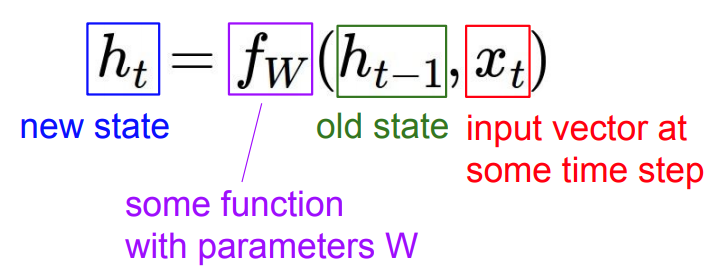

# Recurrent Neural Network

## why need

回顧一下, 目前至今我們討論的內容都是 input 有固定的大小, 例如一張固定大小的圖片, 我們可以將圖片展開成 vector, 經過 hidden layer 後輸出某 score or class, 但是試想今天如果輸入不是固定的, 可能有長有短, 輸入將會不再只是單一個 vector, 將是 set of vector 而我們沒辦法預期 set 裡面有多少內容

到這裡我們可以思考相對的解決方式, 例如將 set 裡面的成員單一個取出來後 input 到 NN 裡頭讓他輸出, 這樣就得到了 set 每個 element 的 output, 但是 set 裡頭的 element 如果前後彼此有關係, 例如上圖中兩個 saw 明顯是不一樣的意思, 我們需要前後文判斷詞性後才知道意思

因此, 我們需要透過 RNN 處理這種 Sequential data, 但注意 RNN 同樣適用於 fixed size input 與 output 的情況!

 

* 一些各情況的例子:
    * one to many: input 為一張圖片, 輸出為對圖片的一段描述
    * many to one: 
        1. input 為一段句子, 輸出為此段句子為 positive or negative。
        2. input 為一段影片, 影片長度的不同代表著 frame 數量的不同, output 為此段影片正在做什麼運動
    * many to many: 翻譯, input 為 a 語言經過機器翻譯後成 b 語言, 而同一句話在不同語言中所需要的長度有可能不同
    * many to many(上圖中最右邊者): 需要對 input 中每一個 element 都做處理

 

(常見的 RNN 應用)

---

## architecture

現在考慮一個 network 的 input 是一個句子的話, 要如何將句子轉換成 vector?

### vector

#### one-hot encoding

將每種詞彙對應到一個 vector, 也就是對應的一個維度, 缺點是沒有辦法透過 one-hot vector 來判斷說某兩個 vector 之間的相近程度(不帶有語意資訊)

#### word embedding 

我們可以把一個句子透過 word embedding 後得到一個向量, 同時帶有語意資訊

#### TODO: [ML Lecture 14: Unsupervised Learning - Word Embedding](https://www.youtube.com/watch?v=X7PH3NuYW0Q&ab_channel=Hung-yiLee)

在講述 RNN architecture 之前先試著以一個簡單的例子介紹, 下面會以 word embedding 的方式將某些 word 轉換成向量輸入至下圖中, 圖中的所有 weight 都設定為 1, 可以將 RNN 想成有記憶力(memory)的 NN

|word|vector|
|:---:|:---:|
|你|00|
|祖|10|
|我|01|
|孫|11|

 

將 input "你" 轉換為 vector 00 後輸入至 network, 因為 weight 皆為 1 得到藍色處皆為 0, 將藍色處結果儲存至紅色處, 最後得到 output 為 0。

 

將 input "祖" 轉換為 vector 01 後輸入至 network, 因為 weight 皆為 1 得到藍色處皆為 1, 再與 step1 計算出來儲存至 memory 的部份相加, 並將藍色處結果儲存至紅色處, 最後得到 output 為 3

因此 RNN 裡的 memory 會用來存放 hiddem layer 的 output, 在下一次輸入時 RNN 不僅會考慮 input, 也會考慮 memory 裡的值

 

中間省略了剩下的計算過程,最後得到的結果:

|word|vector|
|:---:|:---:|
|你祖我孫|42,42|
|我祖你孫|114,114|

上述情況如果使用 Letent Semantic Analysis(LSA) 只單純將詞彙所切開判斷的話兩句話會是一樣的意思, 但是經過 RNN 的結果我們可以看到 output 不一樣, 也就是成功判斷出兩句話不同, **因此 RNN 會考慮 input seqence 的 order**

 

(將上述的計算過程給展開)

 
 

(RNN Computational Graph)

### Elman RNN (Vanilla RNN)

Elman RNN 就是我們上述舉的例子, 將 hidden layer 的值給存起來, 在下一個時間再讀出來

hidden state update:

output generation:

### Jordan network

與 Elman Network 的差異是 Jordan network 存的是 output 非 hidden layer 的結果

---

## ref

* [cs231n lecture10 Recurrent Neural Networks(2021)](http://cs231n.stanford.edu/slides/2021/lecture_10.pdf)
* [hylee Self-attention (2021)](https://speech.ee.ntu.edu.tw/~hylee/ml/ml2021-course-data/self_v7.pdf)
* [YT: ML Lecture 14: Unsupervised Learning - Word Embedding](https://www.youtube.com/watch?v=X7PH3NuYW0Q&ab_channel=Hung-yiLee)
* [YT: Recurrent Neural Networks (RNN) and Long Short-Term Memory (LSTM)](https://www.youtube.com/watch?v=WCUNPb-5EYI&ab_channel=BrandonRohrer)
* [YT: 10分鐘了解RNN的基本概念](https://www.youtube.com/watch?v=6AW80qmaAOk&ab_channel=%E6%9D%8E%E6%94%BF%E8%BB%92)
* [#003 RNN – Architectural Types of Different Recurrent Neural Networks](http://datahacker.rs/003-rnn-architectural-types-of-different-recurrent-neural-networks/)
* [Recurrent Neural Networks cheatsheet](https://stanford.edu/~shervine/teaching/cs-230/cheatsheet-recurrent-neural-networks)