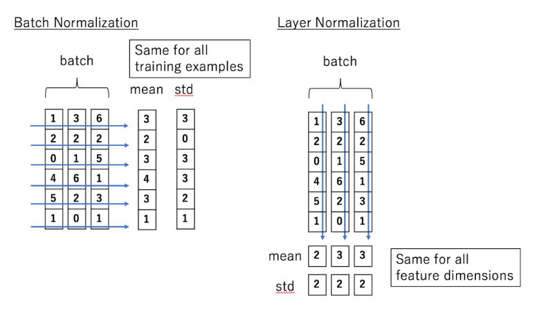
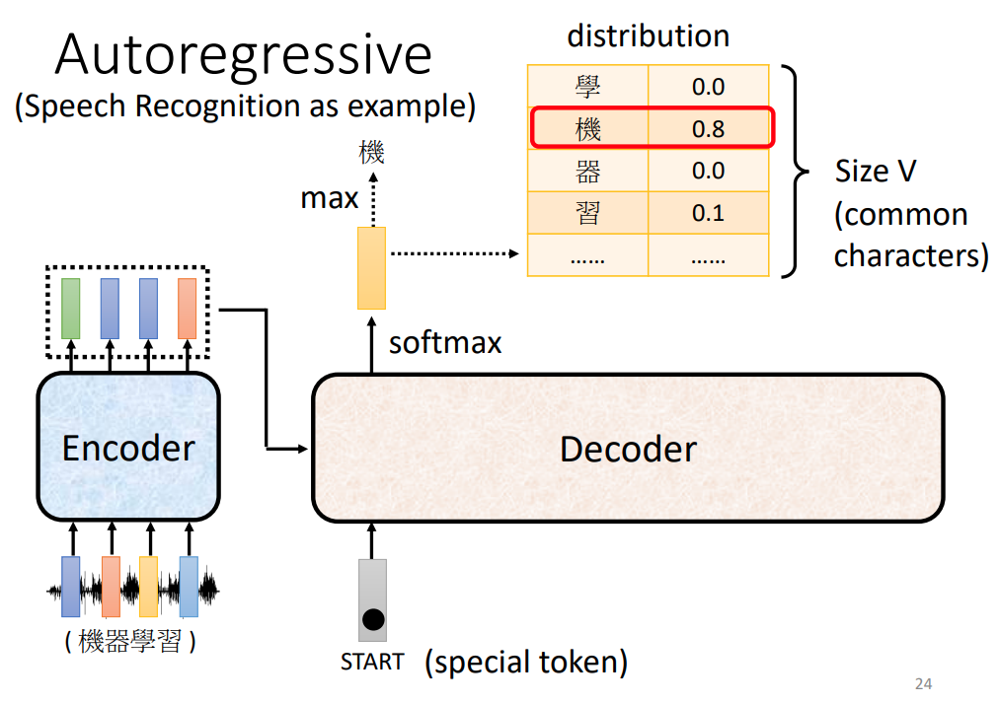

# transformer

- [transformer](#transformer)
  * [issue in RNN](#issue-in-rnn)
  * [self-attention](#self-attention)
    + [mechanism](#mechanism)
    + [Matrix Calculation of Self-Attention](#matrix-calculation-of-self-attention)
    + [positional encoding](#positional-encoding)
    + [multi-head self-attention](#multi-head-self-attention)
  * [transformer](#transformer-1)
    + [encoder](#encoder)
      - [Layer Normalization](#layer-normalization)
    + [decoder](#decoder)
      - [autoregressive](#autoregressive)
        * [start token](#start-token)
        * [masked multi-head self-attention](#masked-multi-head-self-attention)
        * [stop token](#stop-token)
      - [non-autoregressive](#non-autoregressive)
    + [cross attention](#cross-attention)
  * [ref](#ref)

## issue in RNN

1. RNN 為依照順序進行的, 在 t 時沒有完成就不能處理 t+1 的任務
2. 梯度消失: 當 input 過長時會導致在最初時刻的內容遺失, 造成 timestamp 越後面的輸入 dominate

## self-attention

上圖中我們可以再次意識到在沒有 RNN 前, 如果將每個字拆解過後直接丟入 Fully connected network, 對於相同的 input 一定會得到相同的 output, 例如相同的 saw 儘管不同詞性不同意思但仍然會輸出一樣的中文翻譯, 因為只有僅僅考慮單一字無法決定字的詞性為何。而 RNN 儘管考慮了前後的詞語但是仍然具有瓶頸: 當 input 過長時, 會造成 timestamp 較早期的資料遺失。

而 self-attaion 的機制考慮了整個 sequence, 因此不僅解決了 RNN 中的瓶頸問題, 且可以考慮前後文而得到更佳的結果, 例如上圖中原先的四個單字經過一層 self-attention 後考慮了前後文, 因此經過 self-attention 的第二與第四個 vector 不再是相同的內容(原先直接經過 FC 的會都是相同的,因為都是 saw)

### mechanism

 

輸入以 a 表示, 可能來自 input 或是 hidden layer 的 output, 經過 self-attenion 後分別得到 b 四個向量, **注意這邊 b 四個向量是可以平行計算的**, 不用依序產生

 

而 self-attention 需要知道對於 a1 而言, 與 a2, a3 and a4 之間的關係為何, 並且計算出 a1 與其他 vector 的關係, 例如上圖中以  數值來表示 a1 與 a4 之間的關係

 

而計算  的方式常見的為 dot product, 將兩個 vector 分別乘上  與  後再進行 dot product, 在 transformer 中也是使用此方法。在下面提到    時便以 **attention score** 稱呼, 若有下標 1,2 則是代表 vector1 與 vector2 的 attention score, 此分數也代表兩個 vector 的關聯性

 

承接上述, vector  分別乘上  與  後分別會得到  與 , 對於  也是相同道理, 對於  稱為 **query**,  稱為 **key**, 將 query 與 key 相乘(與上面提到的 dot product 相同步驟)就可以得到 attention score, 例如上圖中我們就得到了 a1 與其他三個 vector 的 attention score

 

而通常自己也會與自己計算 attention score。最後得到 a1 與自己, 其他 vector 的 attention score 經過 softmax(**不一定要使用 soft-max**), 後分別得到 , 因此此時我們可以透過這幾個經過 softmax 的機率知道哪一個跟 a1 最有關係, 最後要使用這些與 a1 的關係程度來抽取重要資訊

 

vector a1 再與  相乘後得到 **value** vector , 將  與  分別乘上   後加總就可以得到 b1, 其他 b2, b3 等以此類推。因此對於 b1 而言, 哪個 attention score 越高, 其 value vector 就佔 b1 的成份越多

### Matrix Calculation of Self-Attention

最後以矩陣的方式來表達 mechanism 的內容, 因為 a1, a2 等等都要與 Wq 相乘, 因此可以將 a1, a2 等等以矩陣 I (column 即 a1, a2...) 來表示再乘上 Wq 得到 Q, 其他 Wk 與 Wv 相同道理

 

 

計算 attention score 的部份如上圖, 皆需要乘上 query, 因此可以用矩陣來表示, 矩陣中的 row 就是 k1, k2, k3, k4, 乘上 q1 後就可以得到 attention score。而 q2 也需要對 K1~K4 進行計算 attention score, q3 也是相同道理。 因此總結 attention score 的計算可以看作兩個矩陣相乘, 一個矩陣的 column 分別為 q1~q4, 另一個為 row 分別為 k1~k4, 最後相乘的結果就是 attention score, 最後再經過 normalization

 

因此我們可以總結步驟為:
1. 將 vector sequence 乘上 Wq, Wk, Wv 最後得到 Q K V
2. 計算 attention score: 

### positional encoding

回顧一下目前 self-attention 的操作, 可以知道對於 a1~a4 每個 input 進行動作都相同, 都是由 q 與 k 計算出 attention scoer 等操作, 因此並沒有包含位置資訊, 也就是說對於 sequence 最前面的 a1 而言, a4 與 a2 的距離是一樣的, 但是實際上 a4 是離 a1 最遠的一個, 而位置的資訊有時候可以帶給我們一些有用的資訊, 例如在句子的第一個字往往不會是動詞等等, 如果位置的資訊是需要的, 便可以使用 positional encoding 的方法將位置資訊給嵌入

 

step:
1. 給予每個位置一個 unique positional vector: 
2. 將  加上 

如何決定 positional vector:
1. hand-crafted
2. learn from data 

---

### multi-head self-attention

對於 self-attention 而言用 q 去找相關的 k 得到相關性, 但是相關可能有多種不同的形式與不同的定義, 單一個 q 與 k 無法滿足, 因此需要多個 q 來表達不同種類不同定義的相關性, 而需要多少 head 為 hyperparameter, 在 multi-head self-attention 中的操作與 single-head 大致相同。

 

上圖為 2 head 的例子, 可以看到對於 ai 而言分別有 q_i1 與 q_i2, 分別為 ai 與兩個不同矩陣計算出來的結果, 在計算 attention score 時 q_i1 只要與 k_i1 以及 k_j1 計算即可, 不用理會 k_i2 與 k_j2, 也就是說相同編號進行操作即可(相同編號看成 single-head self-attention)

---

## transformer

 

上圖 transformer 的架構, 可以大致拆解:
* encoder (左半邊)
* decoder (右半邊), decoder 內部又可看作兩部份
    1. decoder (含 masked multi-head self-attention layer 者)
    2. decoder (含 encoder-decoder attention layer 者)

### encoder

 

 

在 transformer 的 encoder 裡頭由許多 block 組成, 這邊之所以稱為 **block** 非 **layer** 是因為每個 block 所作的事情由許多 layer 完成的, 上圖中我們可以看到 input 會先經過 self-attention layer 後 output 一排向量後再輸入到 FC 內, 接著往下看 self-attention 的操作

 

 

在經過 self-attention 時的操作更為複雜, 上圖中可以看到大致分為以下步驟:
1. positional encoding: 將 input 加上 position vector
2. input 送進 self-attention layer 得到 output, 過程如同在 self-attention 提及的部份
3. 將 self-attention layer 的 output 加上 input (圖中的a+b), 這種架構稱為 **residual network**
4. 將 input 與 output 相加的結果 normalization (layer normalization)
5. 將 step3 的結果作為 fully connected 的輸入
6. 將 FC 的 input 與 output 加起來 (residual again)
7. 將 step5 結果 normalization (layer normalization) 此時才是一個 block 的輸出

#### Layer Normalization

layer normalization 輸入是一個向量, 輸出也同樣是個向量, 不用考慮 batch, 計算輸入的 mean 與 standard deviation, 注意 layer normalization 是對同一個 feature 不同 dimension 計算 mean 與 standard deviation (batch: 同一個 dimension 不同的 feature)

 

### decoder

decoder 分為 autoregressive 與 non-autoregressive

#### autoregressive

##### start token

該怎麼讓 decoder 自己生成 output 呢? 

1.首先定義一個開始的 symbol 讓 decoder 吃到這個 symbol 後可以運作, 這個開始的 token 會以 one-hot vector 表示
2. 通過 decoder 後再經過 softmax 得到機率分佈的 vector, 這個 vector 長度等同於你定義的 vocabulary, 例如將 vocabulary 定義為常見的 3000 的中文字, 或是以英文的 word 呈現, 也可以以 A-Z 定義
3. 得到的 vector 中機率最高者為 output 並且也成為 input (decoder 會將自己的輸出作為接下來的輸入)

"機" 作為第一個 output 後與 START vector 一起成為 input 再次作為 decoder 的輸入, 接著得到 "器", etc

##### masked multi-head self-attention

如果暫時將 decoder 某部份給遮起來, 可以發現與 encoder 大同小異, 但是在 multi-head self-attention 的地方 decoder 變成 masked multi-head self-attention, 而與 encoder 不同的原因可以思考對於 encoder, input 與 output 皆可以平行處理, 也就是說可以平行輸入後平行輸出, 但是對於 decoder 會一次輸出一個 output, 非同時輸出, decoder 只能考慮他左邊得資訊沒辦法考慮右邊的資訊

 

這邊描述 masked multi-head self-attention 如何運作, 對於 a2 的 q2 而言, 只能與 k1, k2 計算 attention score, 不可以與 k3, k4 進行計算。同道理, 對於 a3 的 q3 而言, 只能與 k1, k2,k3 計算 attention score, 不可以與 k4 進行計算

##### stop token

 

而 output sequence 的長度多少是不固定的, 因此這個 seqence 的長度我們也會希望是機器自己學習, 但是我們需要一個機制讓機器知道什麼時候要停下來, 因此需要在 vocabulary 裡多加上一個 stop token, 當機器需要停下來的時候 output distribution 的 stop token 的機率就會是最大值

#### non-autoregressive

 

non-autoregressive 與 autoregressive 不同地方是 non-autoregressive 一次會平行輸出, 而 autoregressive 需要依序產生, 因此 NAT 的 decoder 會跑得比 AT 還快。但是需要一次可以輸出 output squence 就需要先知道句子的長度, 方法有:
1. 使用另個 predictor 預測 output sequence 的長度
2. 輸出一個超長的句子, 再忽略句子裡面 END 之後的內容

NAT 的好處:
1. 平行化, 速度較 autoregressive 快
2. 可以控制輸出的長度

缺點:
1. performance 較 AT 差: why? -> Multi-modality

###  cross attention

 

encoder 如何將 output 交給 decoder 的過程稱為 cross attention, 也就是上圖中框選出的區塊。其他藍色圈圈處可以看到是 from encoder, 綠色圈圈處是 from decoder。而此 layer 稱為 **encoder-decoder attention layer**

 

start token 先經過 self-attention 之後得到 output 經過 transform 後得到 q, encoder 的輸出再算出 key (以  表示已經過 normalization) and value, 將 q 乘上 k 後乘上 value 最後相加作為 FC 的 input。所以整個 cross attention 的過程就是經由 decoder 產生的 q 到 encoder 所產生的資訊裡頭抽取資訊出來作為接下來 decoder FC 的 input

因此可以稍微比較 masked multi-head self-attention 中與 encoder-decoder attention layer 的不同是較 masked multi-head self-attention 中 query, key 與 value 的來源相同 ; 但是對於 encoder-decoder attention layer 的 query 與 key, value 來源不同

---

## ref

* [hylee self-attention](https://speech.ee.ntu.edu.tw/~hylee/ml/ml2021-course-data/self_v7.pdf)
* [The Illustrated Transformer](http://jalammar.github.io/illustrated-transformer/)
    * [Transformer图解](http://fancyerii.github.io/2019/03/09/transformer-illustrated/#%E6%A6%82%E8%BF%B0)
