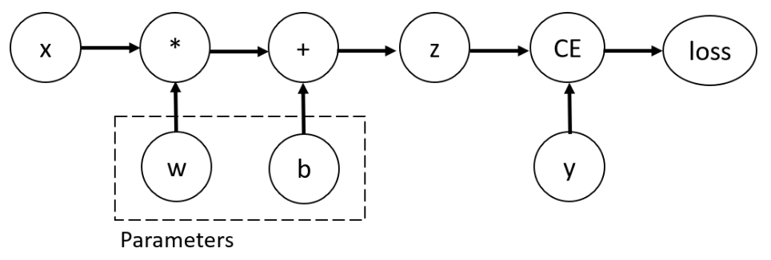

# automatic differentiation

在 training 過程中經常使用到 back propagation, 因此計算 gradient 的計算頻率大幅增加, 不過 Pytorch 內建的 differentiation engine 可以讓我們得到 gradient, 下面以官方文檔的 computation graph 作為例子:

<div align="center">

</div>

此例子也是 note 中我們常常用來舉例的 input 為 x(feature), w and b are parameter, 最後經由 loss function 計算 loss 值:

```python
import torch

x = torch.ones(5)  
y = torch.zeros(3)  
w = torch.randn(5, 3, requires_grad=True)
b = torch.randn(3, requires_grad=True)
z = torch.matmul(x, w)+b
loss = torch.nn.functional.binary_cross_entropy_with_logits(z, y)
```

* 性質說明:
    1. 每個 tensor 皆有 ```requires_grad``` boolean attribute, 表示該 tensor 需不需要進行梯度進算, False 表示不用, 可以提高效率且減少計算
    2. 如果 operation 對應的 input tensor 只要有一者 ```requires_grad``` 是 True, 該 operation 對應 output 的 ```requires_grad``` 也會是 True ; 只有在所有 input 的 ```requires_grad``` 皆為 False, output 的 ```requires_grad``` 才會是 False