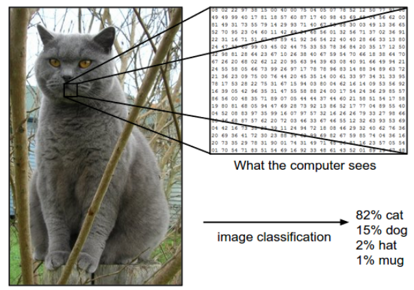
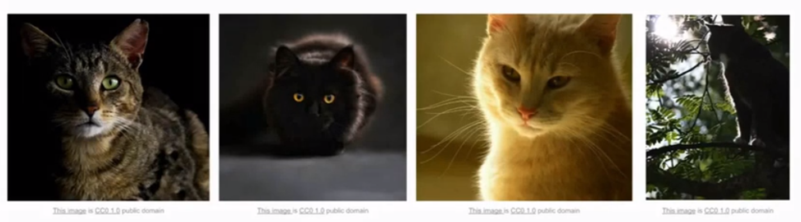
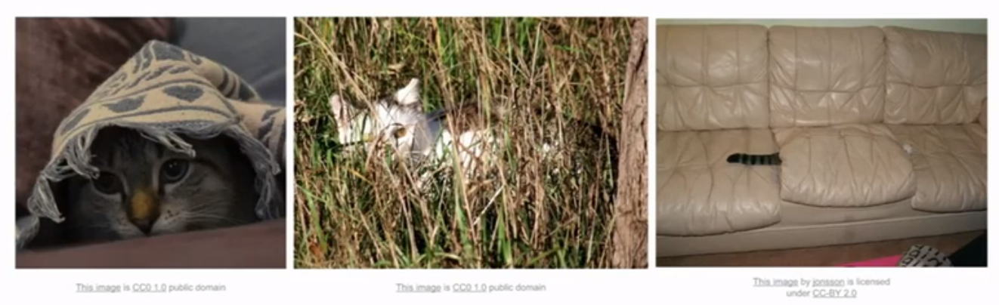
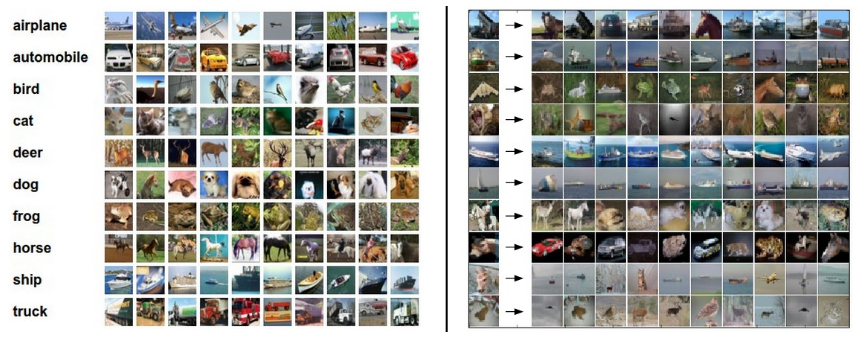
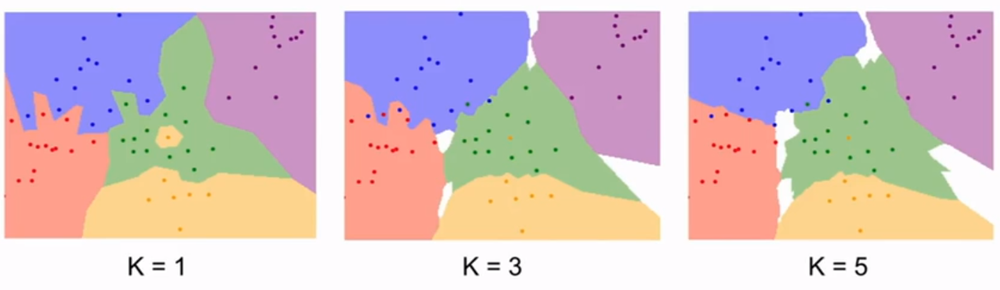
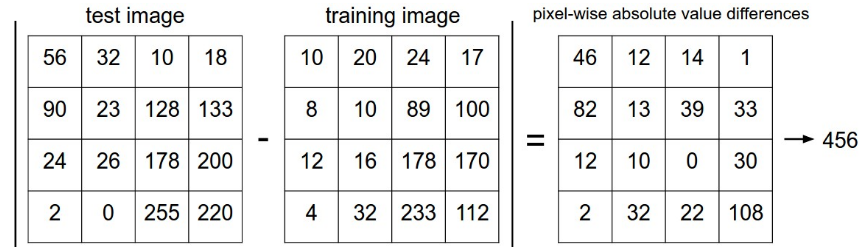
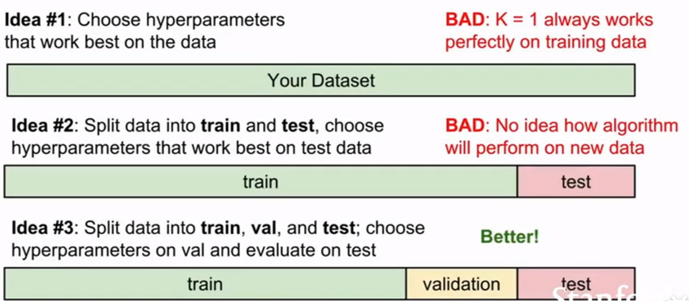
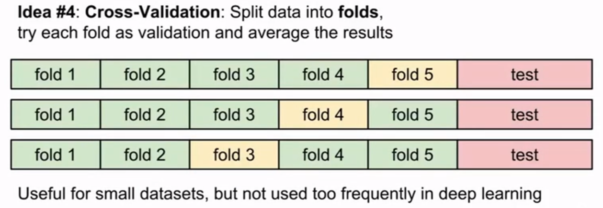
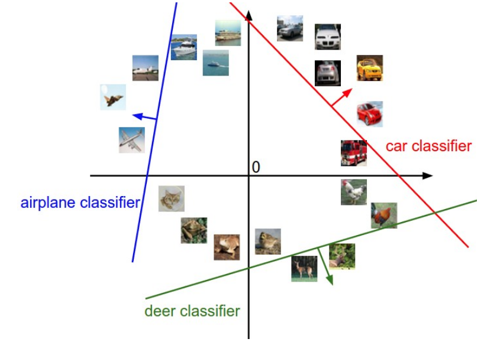
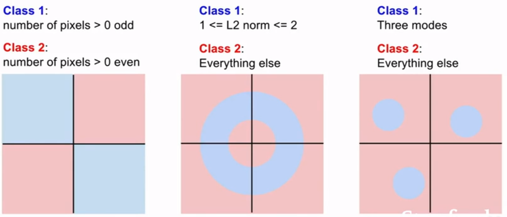

# image classification

## 圖片分類與挑戰

在 Computer Vision 中最核心的問題是如何對圖片進行分類，我們知道當我們人類看到一張動物圖片時，我們可以很快速且直覺地反應說這是哪種動物，因為我們的大腦早就有處理這些的神經存在，但是對於電腦而言，皆收到一張圖片然後要進行分類是有很大的難度的，對於電腦而言接收一張圖片輸入後看到的是可能是一個由 800*600*3 組成的(3 channel of RGB) 的 Array，要如何透過這個 Array 來判斷這張圖片就是某種動物是件相當困難的事情，而這個問題稱為 **semantic gap**，而我們把圖片歸類為某動物時(例如:貓)，貓就是個 semantic label，semantic gap 就是表示貓咪這個概念與電腦中的 pixel value 有相當大的差距

<div>


</div>

除了上述提到的如何透過這堆 pixel value 分類成某動物的問題，還需要考慮以下幾種情況:
1. viewpoint variation: 顧名思義就是我們看某事物的樣貌會隨著我們視角而改變，同樣地 pixel value 也會因此改變，同種動物圖片經過視角改變過後是否能夠依然判斷出是某種動物呢？
2. Illumination conditions: 不同亮度底下的動物圖片是否可以判斷出視同種動物？
3. deformation: 不同動物不會都只有相同姿勢，是否可以判斷不同姿勢下的動物是該種動物？
4. Occlusion: 被遮擋的情況下人類還是有辦法判斷出該種動物是哪種動物，電腦是否有辦法判斷？
5. Background cluttet: 如果背景與動物身上的紋路差不多是否也有判法判斷呢？


<div>


</div>

## 圖片分類的方法: data-driven approach

回到主題，我們該如何辨識一張圖片並對此圖片的內容進行分類？ok 我們也許會很直覺地想要用下面的方法來偵測，但是目前還沒有辦法透過這麼直接的演算法來進行分類:

```python
def classify_image(image):
    # magic
    return class_label
```

另種想法是以動物來說也許會有動物的特徵來讓我們進行分類，例如貓有貓耳朵，尾巴等等，我們對圖片進行邊緣偵測後，把邊與角分類好，但缺點是錯誤率過高，其次是 not scalable(例如今天要偵測其他種動物，就得從頭來一遍，有點像是 hard-code 的概念)，我們要的是某種演算法可以通用在世界上各種東西上: data-driven approach

what is data-driven approach: 不寫具體的分類規則來辨識一隻貓或是一隻狗，而是透過大量的貓的圖片(dataset)，接著讓 machine 來 learning and classifier，也就是說消化大量圖片並讓 machine 以某種方式去做 summarize，知道如何辨識後讓 machine 去辨識新的圖片測試看是否可以正確辨識，因此我們不會只有單一個 function 去做到這些事情，我們需要:

1. train: 接收 input image and labels 然後 output model(memorize all data and labels)

    ```python
    def train(images, labels):
        # machine learning
        return model
    ```

2. predict: 接收 input model and output predict 

    ```python
    def predict(model, test_images):
        # using model to predict labels
        return test_labels
    ```

Example: CIFAR-10: 一個很小的 dataset, 包含了 training set of 50000 images(涵蓋 10 種 lables) and test set of 10000 images, each image is 32x32x3



## Nearest Neighbor Classifier

現實中不實用，但因為簡單且容易實做方便於了解 image classification problem, 想法是根據 ,下圖為一個例子，有多個二維空間下包含五個顏色的點表示五個 category(class label), 而整張圖片中的每個 pixel 會根據最近的 class label 進行著色，也就是說整張圖會根據最接近的顏色點進行切割並塗上顏色形成下圖的樣子，缺點是可以看到綠色區域中有個黃色區域，而綠色區域深入了藍色與紫色的交界處等問題，因此有下面的 KNN 進行改善(Nearest Neighbor Classifier 應該就是 KNN 中 K=1 的情況)


Nearest Neighbor Classifier 在 train 時因為只需要 copy data 因此只需要 O(1) (不管 data 多大, copy ptr 就夠了) 但是在 predict 上需要 O(N)(需要 compare)，因此這並不是個好方法，**我們會希望 classifiers 在 predict 上快一點， training 時慢一點沒關係**, 試想這個 calssifier 如果 deploy 在手機或是 browser 上時 predict 還那麼慢會拖垮整個速度, 但是 Nearest Neighbor Classifier 正好相反，在 train 時很快，在 predict 上很慢

## k-Nearest Neighbor Classifier(KNN)

為 supervised machine learning algorithm。KNN 的想法是物以類聚，越靠近的東西彼此就會越相似, 與 Nearest Neighbor Classifier 不同的是 KNN 並非找尋最近的 class label, 而是找到距離該 pixel 最近的 k 個 label 進行 majority vote, 該 pixel 就歸在票數多的 label(aka. **majority vote**), 也因此會盡量避免使用奇數的 K 值避免平手的情況, 通常較大的 K 值可以得到較平滑的邊界且較好的結果, 下面的圖與上面 Nearest Neighbor Classifier 相同的 dataset 可以看到上述提到的問題得到了改善, 其中白色的區域為在 K 個相鄰點中 no majority 



### distance metric

上述有提到 KNN 就是物以類聚, 越相似的東西的距離就會越近, 因此我們透過 distance 去量化相近的程度, 計算 distance 的方法:

1. L1 distance(Manhattan distance): 直接拿兩張 image 的 pixel 進行相減並取絕對值，結果就是兩張圖片的相異值，下面為一張 4x4 的例子，差異值為 456，兩張相同的圖片透過 L1 distance 得出的差異值就是 0, 兩張 image 差異越大得出的差異值就也越大

&nbsp;&nbsp;&nbsp;&nbsp; =\sum_p\mathopen|I_1^p-I_2^p\mathclose|)



2. L2 distance(Euclidean distance):

&nbsp;&nbsp;&nbsp;&nbsp; =\sqrt{\sum_p(I_1^p-I_2^p)^2})

what is better? 無論是要如何選擇 distance function 還是 K 值的大小, 這兩者都是 **hyperparameters**, 意思是根據不同的目標與 data 而有不一樣的結果沒有絕對的好與壞, 最好的方法是兩者都試

### setting hyperparameter

根據上述面對這些 hyperparameter 該怎麼處理最好的方法就是試試看, 但要怎麼利用 data set 去調整？ 如果我們把所有的 data set 拿去 train 之後再做 test 得到的一定會是個不錯的結果, 這就是像是考試前跟你說會考什麼了, 因此正常來說拿到 data set 之後會先切割成兩塊分別為 train 與 test, 然而單只有 train set 還不夠好, 通常還會再切一塊 validation 出來驗證你 train 的結果, 依照 validation 的結果再修正一下後再進行 test, validation 的作用就像是模擬考, 驗證你準備的如何, 也可以根據模擬考讓你知道可能那一方面需要加強, test 則是最後的大考, 因此 test set 一定是最後才會碰到且只能碰這麼一次, 如果在 test 前就先偷看過就跟偷看考題一樣了




### cross validation

除了上述切割的幾個 set 之外如果今天 dataset 較小, cross validation 的理念是一樣會把 train set 保留一份 validation set, 而 train set 輪流來當 validation set, 例如下圖中第一行 fold 1~4 拿來 train, 而 fold 5 就是用來驗證的, 接著用 fold 1~3 與 fold 5 train, 用 fold 4 進行驗證。

但通常不宜用在 deep learning 上面, 因為重新 train 需要耗費大量時間與計算能力



### problem of KNN

1. very slow at test time, 與我們的需求相反(fast at test time)
2. distance metrics on pixel are not informative: 
    * 上面介紹的像是 L1 distance or L2 並不適合用來描述圖片之間的相異程度, 例如下面四張圖片中右邊三張經過遮擋, shift pixel and 渲染成藍色, 經過 L2 distance 計算原圖與右邊三張經過處理的圖片後, 他們都有同樣的 L2 distance, 但明顯他們是不一樣的圖片, 因此我們可以知道 L2 distance 在這種視覺上的差異並不出色
3. curse of dimensionality: 
    * KNN  做的事情像是利用 data point 去切割區塊出來, 沒有對任何情況進行假設, 所以它依賴於樣本空間上有一定密度的訓練樣本, 所以我們如果希望 classifier 有好的效果, data point 就得密集地出現在空間中避免最近的點離該 pixel 過遠, 也就是過於不相近。
    * 底下的圖片可以看到在一維時我們可能只用 4 個 data point 就夠了, 提升到二維時需要 16 data point, 隨著維度的增長我們可能沒有那麼多的 data point 可以分佈在空間中

    

---

## Linear Classification

help us build up to whole neural networks and whole convolutional networks, 在 neural networks 經常將 linear classifiers 組合在一起建構成 large convolutional networks 


### parametric approach

其中 x 代表 input image, 而 W 代表 weights, 在 Linear classification 之中我們不需要像 KNN 一樣需要 training set, 而是將這些 training set 總結成 W 後利用 f(x,W) 這個 function 與 W 就可以了，因此我們也可以搬移到手機這種 small device 進行因為不再依賴 training set。

f(x,W) 最後將會輸出十種 class 的 score:
* x: input image, 以 CIFAR-10 input 圖片就是 array of 32x32x3 numbers
* W: 權重, 經過 train set 得到的 summarize, 以 CIFAR-10 而言就是 (32x32x3)x10 的 numbers, 可以想成每一種 class 都有一種模板, 因為 10 種 class 所以乘 10
* b:  biases, 當 data set 不平衡時可以用來修正


so linear classification 可以轉換成矩陣的相乘與相加, 對比 KNN 需要比對圖片而言相對的更加快速, 下面為一張 2x2 image 的例子, 包含 3 種 class(cat, dog, and ship), 可以看到最右邊 function 最後的輸出就是三種 class 獲得的分數, w 為經過 train set 獲得的每種 class 的模板, every row of W 就是某 class 的 classifier, x 就是 input image


所以總結來說, linear classifiers 透過 train set 得到 W, 我們可以把 W 視為每種 class 的模板,linear classifiers 再利用這些模板透過矩陣相乘與相加後與 test set 進行比對(template matching), 找出分數最佳者。 因此我們可以視為 linear classifiers 依然在做 Nearest Neighbor 但是更有效率了 (矩陣相乘再相加>>>image compare)

下圖為 CIFAR-10 十種模板可視化的結果:


### problem

如果將圖片從高維度壓縮到二維上面，Linear Classifier 就像是在找一條線切割出某 class 與其他 class, 如下圖左邊圖片

以此方式我們可以發現到 linear classifier 的一些問題:
1. 右邊第一張圖片: 紅色與藍色分別各自位在相反的象限上面，我們找不到一條線有辦法做切割
2. 右邊第三者圖片: multimodel situactions, 藍色 category 位在三個不同的象限上, 例如上面的 CIFAR-10 得到的十種模板中的馬就有此問題, 可以看到模板中有兩個頭, 一個向左看一個向右看, 這也是 linear classifier 無法解決的問題

<div>


<div>

---

## ref

* [Distance metrics and K-Nearest Neighbor (KNN)](https://medium.com/@luigi.fiori.lf0303/distance-metrics-and-k-nearest-neighbor-knn-1b840969c0f4)
* [cs231n](https://cs231n.github.io/classification/)
* [Day 5 / 必備實作知識與工具 / 關於 Training，還有一些基本功（一）](https://ithelp.ithome.com.tw/articles/10240556)
* [Cross-validation: evaluating estimator performance](https://scikit-learn.org/stable/modules/cross_validation.html)
* [機器學習：維度災難（Curse of Dimensionality）](https://blog.csdn.net/qq_39521554/article/details/80653712)