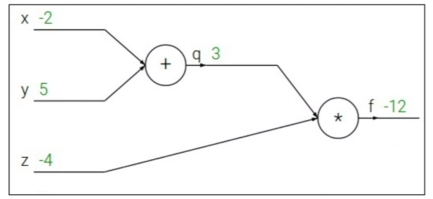
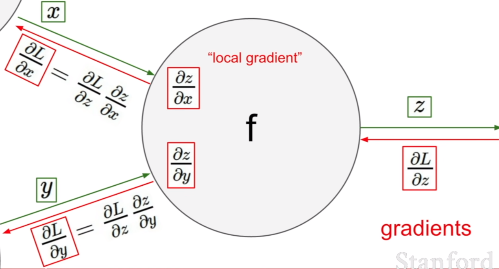

# backpropagation

backpropagation 為實際上用 gradient descent 的方法 train 一個 neural network 的 algorithm

## computation graph

利用 computation graph 來表達任意 function, 在 computation graph 中的 node 表示我們要執行的每一步運算, 一旦 function 可以利用 computation graph 來表達的話就可以利用 backpropagation 技術 recurively 利用 chain rule 算出每個維度的 gradient

Example:

 

 

 

利用變數取代中間的計算結果並計算偏微分的結果:

 

 

backpropagation 顧名思義就是從後面往前進行計算:

 

 

 

為什麼不直接做偏微分, 也可以直接得到一樣的結果是因為這邊的 function 太過簡單, 很容易做偏微分, 但如果是一個很複雜的 function 依然可以利用 computation graph 做出來且容易 implement

 

 

因此總結 computation graph 要如何計算 local gradient, 就是用上游得到的 gradients 乘上 local gradient 就能得到 input gradient

Example:

---

## ref

* [cs231n Course Notes : Backpropagation, Intuitions](https://cs231n.github.io/optimization-2/)
* [YT: cs231n Lecture 4 | Introduction to Neural Networks](https://www.youtube.com/watch?v=d14TUNcbn1k&list=PLC1qU-LWwrF64f4QKQT-Vg5Wr4qEE1Zxk&index=4&ab_channel=StanfordUniversitySchoolofEngineering)